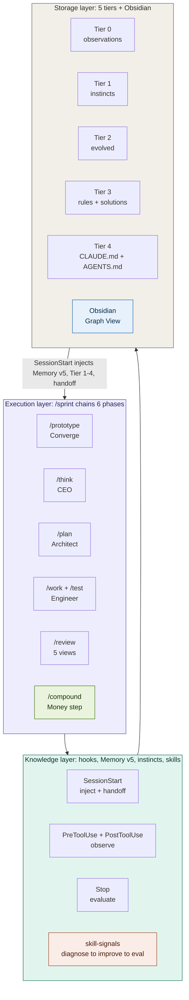
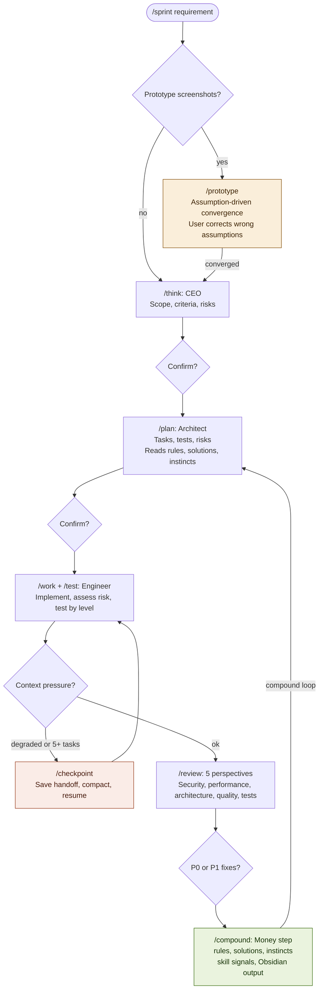
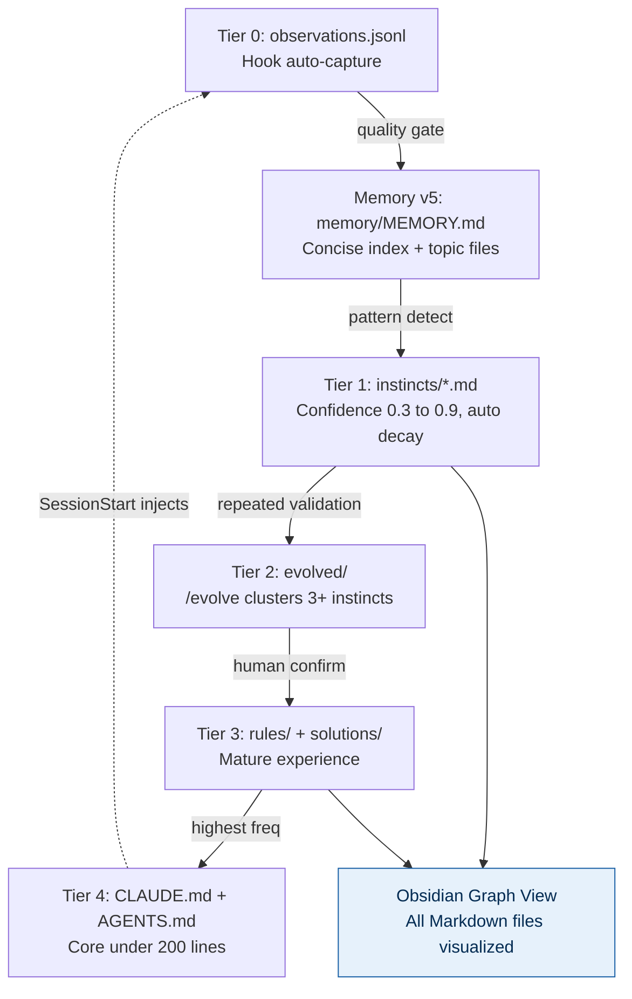
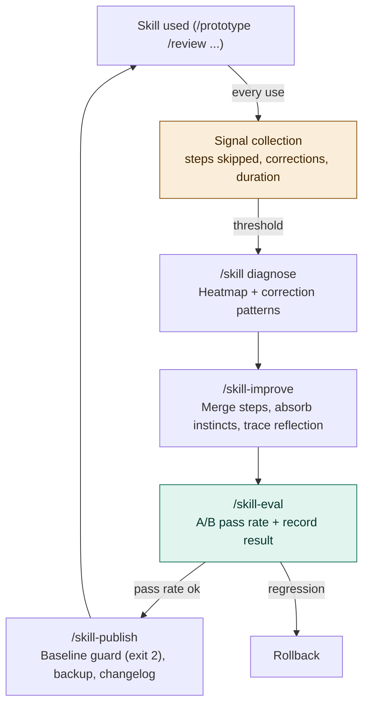
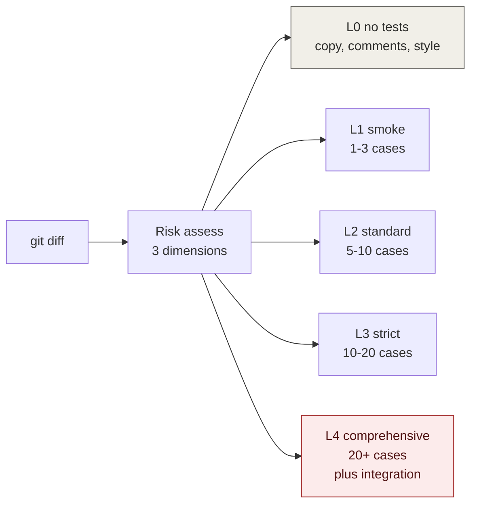

# Claude Code / Codex 自进化工程系统

> 融合 gstack 角色分工 + Compound Engineering 复利循环 + ECC/Claude-Mem 自学习本能 + Skill 自迭代 + 风险自适应测试 + 上下文交接 + Obsidian 知识图谱。
> 22 个用户命令 · 3 个项目命令 · 10 个按需技能 · 4 个 Hook · Memory v5 · Caveman 压缩层 · 5 层知识存储。
> 支持 Claude Code 原生目录和 Codex 原生插件两种运行时；每一次工作都让下一次更容易。

---

## 设计哲学

| 问题 | 来源 | 解法 |
|------|------|------|
| 如何分工 | gstack | 同一模型不同阶段切换角色（CEO→架构师→工程师→审查团队） |
| 如何复利 | Compound Engineering | 每次工作的经验沉淀为文档，供下次规划自动读取 |
| 如何记忆 | ECC + Claude-Mem + Memory v5 | 4 Hook 自动观察，生成 `MEMORY.md` 启动索引、topic 记忆和带置信度的本能 |
| 如何适应 | Skill 自迭代 | 使用信号 → 诊断 → 改进提案 → eval 验证 → 发布新版 |
| 如何测试 | 风险自适应 | 评估变更风险等级(L0-L4)，自动匹配测试深度 |
| 如何持续 | 上下文交接 | 长任务 checkpoint + 交接文件 + 自动恢复 |
| 如何跨 Agent 协作 | Agent Loop v7 | v6 external orchestrator 继续负责冻结 spec / 实现 / 复审；v7 增加 caveman 输出与 memory 压缩能力 |
| 如何可视化 | Obsidian | 所有产出 Obsidian 兼容，Graph View 展示知识关联 |

---

## 架构总览



---

## 执行流程



---

## 知识生命周期



---

## Skill 自迭代



---

## 测试策略



---

## 安装

### 环境要求
Node.js >= 18 · Git · Claude Code CLI 或 Codex CLI

### 统一安装（Windows 推荐）

同时覆盖 legacy Claude Code、Codex、Claude Code plugin 三个安装面：

```powershell
powershell -ExecutionPolicy Bypass -File .\install-all.ps1 -All
```

排查时可以只跳过某个安装面：

```powershell
powershell -ExecutionPolicy Bypass -File .\install-all.ps1 -All -SkipPlugin
powershell -ExecutionPolicy Bypass -File .\install-all.ps1 -All -DryRun
```

### Claude Code

Windows:
```powershell
node scripts\preflight.js
powershell -ExecutionPolicy Bypass -File .\install.ps1 -All
node scripts\validate-claude-install.js --project
```

macOS/Linux:
```bash
node scripts/preflight.js && bash install.sh --all
node scripts/validate-claude-install.js --project
```

### Codex

Codex 使用原生插件包 `plugins/tech-persistence/`，用户级安装会复制到 `~/plugins/tech-persistence` 并更新 `~/.agents/plugins/marketplace.json`。Codex 知识库默认写入 `~/.codex/homunculus`，可用 `TECH_PERSISTENCE_HOME` 临时覆盖，也可用 `~/.tech-persistence/config.json` 配置持续共享目录。

当前 Codex CLI 的 TUI slash commands 只注册内置命令；插件工作流通过 skills 调用。Claude Code 中仍使用 `/sprint`、`/prototype`，Codex 中使用 `$sprint <需求>`、`$prototype <需求>`、`$plan <需求>`、`$caveman`，也可以用 `@` picker 选择同名 skill。

Windows:
```powershell
node scripts\preflight.js --codex
powershell -ExecutionPolicy Bypass -File .\install-codex.ps1 -All
```

macOS/Linux:
```bash
node scripts/preflight.js --codex
bash install-codex.sh --all
```

迁移 Claude 历史知识库（可选）：
```powershell
powershell -ExecutionPolicy Bypass -File .\install-codex.ps1 -All -ImportClaude
```

```bash
bash install-codex.sh --all --import-claude
```

### Claude Code 与 Codex 共享知识库（推荐）

如果你同时使用 Claude Code 和 Codex，推荐把同一个 homunculus 目录作为 Obsidian vault：

```powershell
powershell -ExecutionPolicy Bypass -File .\install.ps1 -Obsidian -SharedHomunculus "C:\Users\you\Documents\TechPersistence"
powershell -ExecutionPolicy Bypass -File .\install-codex.ps1 -All -SharedHomunculus "C:\Users\you\Documents\TechPersistence"
```

```bash
bash install.sh --obsidian --shared-homunculus ~/Documents/TechPersistence
bash install-codex.sh --all --shared-homunculus ~/Documents/TechPersistence
```

这会写入 `~/.tech-persistence/config.json`，两边 Hook 会自动解析同一个 `homunculusHome`。`--import-claude` 是一次性复制历史数据；`--shared-homunculus` 才是持续同步模式。

未配置共享目录时，Claude Code 默认写 `~/.claude/homunculus`，Codex 默认写 `~/.codex/homunculus`。SessionStart 会合并两个默认目录中的 Memory v5 topic notes 后再注入，避免某一边的 `MEMORY.md` 遮蔽另一边；但文件级写入仍各自保留在默认目录里。

插件构建与验证：
```powershell
node plugins/tech-persistence/scripts/build-codex-plugin.js
node scripts/validate-codex-plugin.js
node scripts/validate-codex-install.js --project
node scripts/smoke-cross-platform.js
```

跨平台防线：`.github/workflows/macos-cross-platform.yml` 会在 `macos-latest`
上运行 Bash 安装器语法检查、核心 smoke、Claude/Codex 临时目录安装探针。

### Agent Loop v7（跨 Agent 编排 + Caveman 压缩）

当任务需要“需求分析/设计”和“实现/验收”分离时，继续使用 v6 外部 orchestrator，而不是让两个 Agent 在各自上下文里互相模拟。v7 在此基础上增加 caveman 输出压缩和 memory 文件压缩 skill：

```powershell
node scripts\agent-orchestrator.js run --requirement "原始需求"
node scripts\agent-orchestrator.js freeze --run <runId>
node scripts\agent-orchestrator.js resume --run <runId> --validation-command "npm test"

# 可选：拆分 implementation 与 review 的人工 gate
node scripts\agent-orchestrator.js resume --run <runId> --no-review     # 只跑实现，停在 implemented
node scripts\agent-orchestrator.js resume --run <runId> --review-only   # 跳过实现，只跑复审

# 环境与脚本预检
node scripts\agent-orchestrator.js doctor
node scripts\agent-orchestrator.js self-test
node scripts\agent-orchestrator.js status --run latest
```

命令入口（参数与 CLI 对齐）：

```text
/agent-loop <原始需求>             # Claude Code 入口
/agent-loop freeze <runId>
/agent-loop resume <runId>
/agent-loop status [runId|latest]
/agent-loop doctor
/agent-loop self-test
$agent-loop <原始需求>             # Codex 入口（同名 skill）
```

运行产物写入 `.agent-runs/<runId>/`，包含冻结 spec、技术设计、任务拆解、diff、validation、handoff、review、follow-up task，以及带时间戳的 provider 日志和 prompt 文件。`.agent-runs/` 是运行态目录，不进入 Git。

### Agent Loop pipeline 模式（可选 opt-in，2026-05-11 新增）

当默认串行模式的"一次性 freeze 整个 spec"成为瓶颈时，加 `--pipeline` 进入分片流水线：全局契约先 freeze、再分批生成可执行 slice，每个 slice 独立 freeze、Codex 实现、Claude review，最后做 integration review。

```powershell
# 默认模式完全不变；只有显式 --pipeline 才进入新状态机
node scripts\agent-orchestrator.js run --requirement "..." --pipeline
node scripts\agent-orchestrator.js run --requirement "..." --pipeline --auto

# pipeline 模式 freeze 必须显式 target
node scripts\agent-orchestrator.js freeze --run <id> --target global-contract
node scripts\agent-orchestrator.js freeze --run <id> --target slice --slice-id <slice>

# contract-conflict 恢复 / blocked slice 重排 / 主动放弃
node scripts\agent-orchestrator.js resume --run <id> --resolve accept-revision --revision <id>
node scripts\agent-orchestrator.js resume --run <id> --resolve reject-revision --revision <id>
node scripts\agent-orchestrator.js resume --run <id> --unblock <sliceId>
node scripts\agent-orchestrator.js abandon --run <id>

# 不调用 provider 验证完整 artifact 拓扑
node scripts\agent-orchestrator.js run --requirement "smoke" --pipeline --dry-run
```

Pipeline run 额外写入 `global-contract.json` / `global-contract.history.jsonl` / `contract-revisions.jsonl` / `queue.json` / `locks.json` / `drift-report.json` / `slices/<id>/{slice,handoff,review,diff,validation}.*`。详细双层状态机、契约 hash 范围、drift 五级分类、reconciliation 递归终止、`--auto` safe 集合等设计见 `docs/architecture/agent-loop-pipeline-architecture.md`。

Caveman 入口：

```text
$caveman                    # 启用精简表达模式
$caveman-commit             # 生成 Conventional Commit 消息
$caveman-review             # 生成一行式 review comment
$caveman-compress <file>    # 压缩自然语言 memory 文件
```

SessionStart hook 会注入 caveman 规则；如需关闭自动激活，设置 `CAVEMAN_DEFAULT_MODE=off`。

### 自动审查模式（--auto）

所有工作流命令支持 `--auto` 可选参数。模型基于风险等级 / destructive 标志 / 用户行为 / 置信度，自主判断每个本应人工 gate 的环节是否仍需用户确认：

```text
/sprint --auto <需求>          # 全流程冲刺，phase 间 gate 智能跳过
/work --auto                   # 按计划执行，L4/destructive 仍强制问
/agent-loop --auto <需求>      # spec 通过自校验则自动 freeze
/review --auto                 # obvious P0 自动修，语义级 P0 仍问
```

口语触发同样有效："自动跑完"、"yolo"、"auto mode"。强制人工边界（无视 `--auto`）：destructive 不可逆、L4 风险、安全/认证、scope creep、测试失败。完整决策矩阵见 `~/.claude/rules/auto-mode.md`（Codex 下为 `~/.codex/rules/auto-mode.md`）。

`--auto` 与 `--caveman` 正交，可组合：`/sprint --auto --caveman <需求>`。

### 目标驱动循环（--goal）

`/sprint --goal "<目标>"` 把目标提升为一等被追踪对象（写入 sprint 文档 frontmatter，注入每个 Phase 作为 north-star），允许 think→plan→work→review→compound 循环重入直到目标达成或触发终止：

```text
/sprint --goal "<目标>" <需求>              # 目标驱动循环，人工 gate 全保留
/sprint --goal "<目标>" --auto <需求>       # 目标驱动 + 自主循环
/sprint --goal "<目标>" --max-iter 3 --until "npm test" <需求>
```

终止优先级（确定性优先）：`--until` 命令 exit 0 或迭代达 `--max-iter`（默认 3，硬上限）即停，**优先于** LLM 目标达成自评（仅 advisory，可提前停、不可越天花板）。`--goal` 单独使用不开启自主——自主循环必须显式叠加 `--auto`。`--runtime current|both`（默认 current；both 委托 agent-loop 编排器，本版本仅文档化）。三者正交可组合。完整协议见 `user-level/commands/sprint.md` 的「Goal Loop 协议」段。

### Obsidian 集成（可选）
```powershell
.\install.ps1 -Obsidian     # 初始化 Obsidian vault
```
参考 `docs/obsidian-setup.md` 完成 Claude 独立、Codex 独立或共享 vault 配置。

---

## 命令速查（24 个）

表中保留 Claude Code 的 `/command` 写法。Codex 中把前缀换成 `$`，例如 `/sprint` → `$sprint`、`/prototype` → `$prototype`。

### 工作流（8 个）
| 命令 | 角色 | 作用 |
|------|------|------|
| `/think` | CEO | 需求审视、范围锁定 |
| `/plan` | 架构师 | 任务拆解、风险评估 |
| `/work` | 工程师 | 按计划实现 + 按风险等级测试 |
| `/test` | 测试工程师 | 独立风险评估 + 分级测试 |
| `/review` | 审查团队 | 5 视角审查（含测试覆盖 vs 风险匹配） |
| `/compound` | 知识管理 | 经验+本能+方案+skill 信号+Obsidian 输出 |
| `/sprint` | 指挥官 | 全链路编排 + 自动 checkpoint + resume + 目标驱动循环 (`--goal`) |
| `/agent-loop` | 外部编排器 | v7 跨 Agent：冻结 spec → codex 实现 → spec review；caveman 压缩输出；可选 `--pipeline` 分片流水线 |

### 需求收敛（1 个）
| 命令 | 作用 |
|------|------|
| `/prototype` | 假设驱动：输出完整方案，用户只纠偏不对的部分 |

### 上下文管理（1 个）
| 命令 | 作用 |
|------|------|
| `/checkpoint` | 保存 sprint 状态到交接文件，为上下文重置做准备 |

### 知识管理（5 个）
| 命令 | 作用 |
|------|------|
| `/learn` | 轻量经验提取（/compound 子集） |
| `/debug-journal` | 调试全过程 + 自动回归测试 |
| `/session-summary` | 会话总结报告 |
| `/retrospective` | 全面回顾 + skill 诊断 |
| `/review-learnings` | 跨层搜索统计 |

### 本能系统（4 个）
| 命令 | 作用 |
|------|------|
| `/instinct-status` | 本能面板 |
| `/evolve` | 本能聚类进化 |
| `/instinct-export` | 导出本能 |
| `/instinct-import` | 导入本能 |

### Skill 自迭代（5 个）
| 命令 | 作用 |
|------|------|
| `/skill <action> <name>` | **统一入口**：list / diagnose / eval / improve / publish / auto |
| `/skill-diagnose` | alias → `/skill diagnose` |
| `/skill-improve` | alias → `/skill improve` |
| `/skill-eval` | alias → `/skill eval` |
| `/skill-publish` | alias → `/skill publish` |

### 项目级（3 个）
| 命令 | 作用 |
|------|------|
| `/learn` (项目级) | 项目特有经验提取 |
| `/debug-journal` | 项目调试日志 |
| `/retrospective` | 项目回顾 + skill 诊断 |

---

## 使用节奏

Codex 中使用同名 `$skill` 入口；例如下面的 `/sprint` 在 Codex 中输入 `$sprint`。

```
大功能 (>2h):     /sprint '需求' → auto checkpoint if needed
跨 Agent 实现:     /agent-loop '需求' → freeze spec → resume implementation/review
原型驱动:         /prototype → 纠偏 → /plan → /work → /prototype compare
中等任务:         /plan → /work → /review → /compound
修 Bug:           修 → /debug-journal → /compound
小改动:           改 → /compound
探索:             对话 → /learn
月度维护:         /retrospective (含 skill 诊断)
Skill 优化:       /skill diagnose → /skill-improve → /skill-eval → /skill-publish
长任务中断:       /checkpoint → /compact → 下次 /sprint resume
```

---

## 自动化 Hook

| Hook | 脚本 | 作用 |
|------|------|------|
| SessionStart | inject-context.js | 注入 Memory v5 索引、本能、会话摘要 + 检测 handoff/prototype 状态 |
| UserPromptSubmit | prompt-submit.js | 按当前 prompt 召回相关 Memory v5 entries / sessions / instincts（query-aware recall，ASCII + CJK 2-gram + 路径切分） |
| PreToolUse | observe.js pre | 规范化并脱敏工具输入 |
| PostToolUse | observe.js post | 捕获工具结果、命令状态、文件路径 |
| Stop | evaluate-session.js | 模式检测 + Memory v5 写入 + 本能提取 + 衰减 |

环境变量 `TECH_PERSISTENCE_DISABLE_PROMPT_RECALL=1` 可关闭 UserPromptSubmit recall（兜底）。

---

## Memory MCP（5 工具）

Plugin 安装后自动注册 `tech-persistence-memory` MCP server，暴露：

| Tool | 作用 |
|------|------|
| `tp_memory_search` | 按 query / files / sprint tags 召回 Memory v5 / sessions / instincts |
| `tp_memory_recent` | 列出当前项目最近的 session 摘要 |
| `tp_memory_save` | 手动写一条 durable note 到当前项目 topic 文件 |
| `tp_memory_file_history` | 查某文件路径或 basename 在 memory 中的引用记录 |
| `tp_memory_project_profile` | 当前项目 memory 概览（按 topic 计数 / top confidence / 最新日期） |

Agent 可主动调用，无需被动等待 SessionStart 注入。手动调试：
```bash
printf '%s\n' '{"jsonrpc":"2.0","id":1,"method":"initialize","params":{}}' \
  '{"jsonrpc":"2.0","id":2,"method":"tools/list","params":{}}' \
  | node scripts/memory-mcp-server.js
```

---

## agentmemory 桥接（可选 P2）

`scripts/memory-export.js` 把当前 Memory v5 导出为 agentmemory-compatible 格式（不替换主存储）：

```bash
node scripts/memory-export.js --format=jsonl --output=memory.jsonl
node scripts/memory-export.js --format=markdown --output=./export-dir
node scripts/memory-export.js --format=jsonl --output=memory.jsonl --push=agentmemory  # 需 env AGENTMEMORY_URL
```

每条记录带稳定 id `tech-persistence:v5:<project-id>:<memory-id>` + provenance metadata，round-trip 安全（同一 entry 多次导出 id 不变）。

---

## 按需加载技能（5 个）

| 技能 | 触发条件 | 加载内容 |
|------|---------|---------|
| memory | 涉及记忆管理 | 增强记忆方法论 |
| continuous-learning | 系统说明需要时 | 自学习系统定义 |
| prototype-workflow | 上传原型截图 | 假设驱动收敛方法论 |
| test-strategy | 代码变更/测试 | 风险评估矩阵 + 五级测试深度 |
| context-handoff | sprint 中上下文压力 | checkpoint + 交接文件方法论 |

不触发时不加载，零上下文占用。

---

## 测试策略

| 等级 | 适用 | 用例数 | 耗时占比 |
|------|------|--------|---------|
| L0 免测 | 样式/文案/注释 | 0 | 0% |
| L1 冒烟 | 低风险新增 | 1-3 | 10% |
| L2 标准 | 常规开发 | 5-10 | 20-30% |
| L3 严格 | 核心逻辑/API | 10-20 | 40-50% |
| L4 全面 | 支付/认证/数据迁移 | 20+ | 60%+ |

风险评估自动完成（影响面 × 可逆性 × 变更类型），用户只在不对时纠偏。

---

## Obsidian 集成

所有知识产出统一使用 Obsidian 兼容格式（frontmatter + wikilinks + tags）。共享模式下，Claude Code 和 Codex 会写入同一个 homunculus vault，再由 Obsidian Sync、iCloud、OneDrive、Dropbox 或 Syncthing 做跨设备同步。

| 产出 | Tag | Graph 颜色 | 产生方式 |
|------|-----|-----------|---------|
| 本能 | `#instinct` | 紫色 | Hook + /compound |
| Memory | `#memory` | 蓝色 | Stop Hook |
| 会话 | `#session` | 绿色 | Stop Hook |
| 解决方案 | `#solution` | 深绿 | /compound |
| 规则 | `#rule` | 橙色 | /compound /learn |
| 架构 | `#architecture` | 红色 | /compound |
| Sprint | `#sprint` | 青色 | /sprint |
| 交接点 | `#handoff` | 金色 | /checkpoint |

详细配置见 `docs/obsidian-setup.md`，使用方法见 `docs/obsidian-usage.md` 和 `docs/obsidian-sprint-usage.md`。

---

## 本能置信度

| 分数 | 行为 | 提升 | 衰减 |
|------|------|------|------|
| 0.9+ | 自动应用 | +0.1/验证 | -0.05/14天 |
| 0.7+ | SessionStart 注入 | | |
| 0.5+ | 相关时建议 | | |
| 0.3+ | 被问到时提及 | | |
| <0.3 | 候选删除 | | |

---

## 目录结构

```
~/.claude/                              ← 用户级 (跟着你走)
├── CLAUDE.md                           ← 核心偏好 + 路由规则 (< 200行)
├── settings.json                       ← 4 Hook 配置
├── commands/ (22 个)                   ← 全部用户命令
├── rules/general-standards.md
├── skills/                             ← 10 个按需加载技能
│   ├── memory/
│   ├── continuous-learning/{SKILL.md, hooks/}
│   ├── prototype-workflow/
│   ├── test-strategy/
│   ├── context-handoff/
│   └── caveman*/
└── homunculus/                         ← 知识存储
    ├── instincts/{personal/, inherited/}
    ├── evolved/{skills/, commands/, agents/}
    ├── skill-signals/                  ← 使用信号
    ├── skill-evals/                    ← 测试集 + {name}/cases/cases.jsonl (trace 沉淀用例) + {name}/results/results.jsonl (publish 护栏基线)
    ├── skill-traces/                   ← 失败/纠正 trace ({name}.jsonl, improve 根因反思源)
    ├── skill-changelog/                ← 变更记录
    └── projects/{hash}/
        ├── memory/MEMORY.md             ← Memory v5 启动索引 (<200 行 / 25KB)
        ├── memory/{topic}.md            ← 调试/测试/工具链等细节
        ├── instincts/
        └── sessions/

your-project/                           ← 项目级 (提交 Git)
├── CLAUDE.md
├── .claude/{commands/, rules/, plans/}
└── docs/
    ├── solutions/                      ← /compound 产出
    └── plans/                          ← /sprint + /checkpoint 产出

plugins/tech-persistence/               ← Codex 原生插件包
├── .codex-plugin/plugin.json
├── commands/                            ← 22 个兼容命令源文件
├── skills/                              ← 10 个按需技能 + 22 个 command skill wrappers
├── hooks.json                           ← 4 Hook 配置
├── hooks/                               ← Codex runtime hook scripts
├── scripts/                             ← build/import utilities
└── codex-homunculus-template/

Codex 调用方式：
`$sprint <需求>`、`$agent-loop <需求>`、`$prototype <需求>`、`$plan <需求>`，或用 `@` 选择同名 skill。
当前 Codex CLI 会把 `/sprint` 和 `/tech-persistence:sprint` 当作未知 TUI slash command。

~/.codex/                              ← Codex 用户级 (与 ~/.claude 对齐)
├── AGENTS.md                           ← 核心偏好 + 路由规则
├── commands/ (22 个)                   ← 兼容命令源文件
├── rules/general-standards.md
├── skills/                             ← 10 个按需技能 + 22 个 command skill wrappers
│   ├── memory/
│   ├── continuous-learning/{SKILL.md, hooks/}
│   ├── prototype-workflow/
│   ├── test-strategy/
│   ├── context-handoff/
│   └── sprint/, prototype/, plan/, work/, review/, ...
└── homunculus/                         ← Codex 用户级知识存储
    └── projects/{hash}/
        ├── memory/MEMORY.md             ← Memory v5 启动索引 (<200 行 / 25KB)
        ├── memory/{topic}.md            ← 调试/测试/工具链等细节
        ├── instincts/
        └── sessions/

your-project/                           ← Codex 项目级 (提交 Git)
├── AGENTS.md
├── .codex/{commands/, rules/, plans/, skills/}
└── docs/solutions/
```

---

## 健康指标

| 指标 | 阈值 | 动作 |
|------|------|------|
| CLAUDE.md | > 200 行 | 迁移到 rules/ |
| MEMORY.md | > 200 行或 > 25KB | 裁剪索引，细节保留在 topic 文件 |
| rules 文件 | > 100 行 | 拆分 |
| 本能数量 | > 50 | /evolve |
| 观察日志 | > 10 MB | 归档 |
| Skill 放弃率 | > 30% | /skill diagnose |
| Skill 纠正 | 3+ 次 | /skill diagnose |
| Sprint 中 Task > 5 | — | 建议 /checkpoint |
| 会话轮次 > 30 | — | 建议 /checkpoint |

---

## 核心原则

1. **分层存储**：高频→CLAUDE.md/AGENTS.md · 分类→rules/ · 原子→instincts/ · 方案→solutions/
2. **分层加载**：CLAUDE.md/AGENTS.md 路由 · Memory v5 启动索引 · skill 按需 · rules 路径匹配
3. **轻量记忆**：`MEMORY.md` 只放高价值索引，细节进入 topic 文件，避免污染上下文
4. **假设驱动**：输出方案让用户纠偏，不做冗长问答
5. **风险自适应**：测试深度跟着变更风险走，不多不少
6. **自动优先**：Hook 100% 捕获 · 手动命令做深度提取
7. **复利导向**：/compound 产出 → 下次 /plan 自动读取
8. **Skill 进化**：使用信号 → 诊断 → 验证 → 发布
9. **上下文安全**：长任务自动 checkpoint，不怕上下文溢出
10. **Obsidian 原生**：所有产出 frontmatter + wikilinks，Graph View 可视化
11. **80/20 分配**：80% 规划审查 · 20% 执行
12. **先学后压**：永远先 /compound 再 /compact

---

## 版本演进

```mermaid
flowchart LR
    V1["v1 Manual<br/>/learn + rules<br/>/compact management"]
    V2["v2 Auto-learning<br/>4 hooks<br/>instinct confidence and decay<br/>project isolation"]
    V3["v3 Workflow<br/>role switching<br/>compound loop<br/>/sprint + /prototype"]
    V4["v4 Self-iteration<br/>skill signals<br/>risk-adaptive testing<br/>checkpoint + resume<br/>Obsidian integration"]
    V5["v5 Codex Memory<br/>payload normalization<br/>MEMORY.md compact index<br/>topic files<br/>confidence-gated writes"]
    V6["v6 Agent Loop<br/>external orchestrator<br/>frozen spec contract<br/>Codex handoff<br/>Claude review loop"]
    V7["v7 Compression Layer<br/>caveman output mode<br/>memory file compression<br/>Claude and Codex parity hardening"]

    V1 --> V2 --> V3 --> V4 --> V5 --> V6 --> V7

    style V1 fill:#F1EFE8,stroke:#5F5E5A,color:#2C2C2A
    style V4 fill:#E1F5EE,stroke:#0F6E56,color:#04342C
    style V5 fill:#E6F1FB,stroke:#185FA5,color:#042C53
    style V6 fill:#EEEDFE,stroke:#534AB7,color:#26215C
    style V7 fill:#FAEEDA,stroke:#854F0B,color:#412402
```



v7 保留 v6 的外部 orchestrator 边界：冻结 spec、Codex 实现、Claude 复审仍由同一条编排链路完成。新增能力集中在压缩层，包括 `$caveman` 精简输出模式、`$caveman-compress` 压缩自然语言 memory 文件，以及围绕 Claude Code / Codex 双运行时的一致性加固。

> **深度演进总结**：V1→V7 与加固期的触发痛点、ADR 因果链、5 条元方法论与 7 项未闭合张力，见 [架构演进全景：V1→V7 与加固期](docs/architecture/2026-05-28-evolution-overview.md)。
