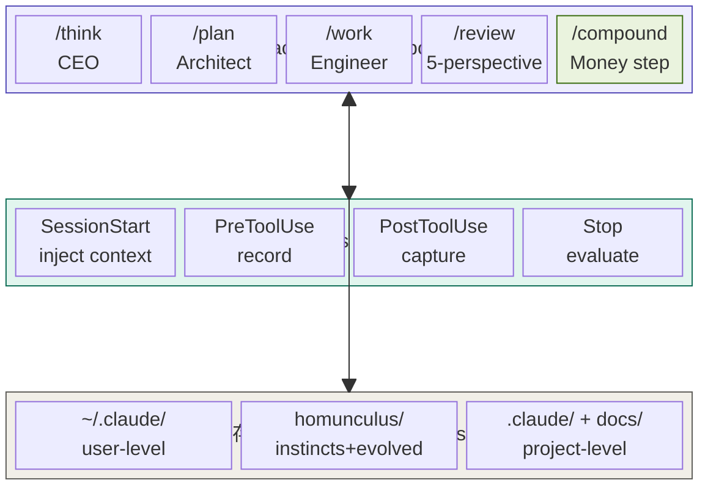
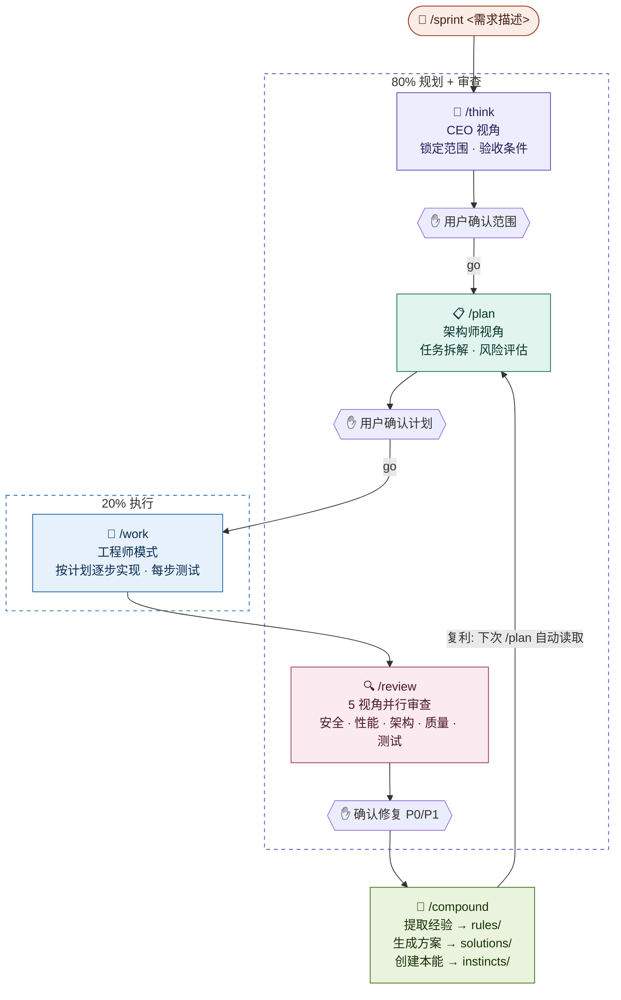
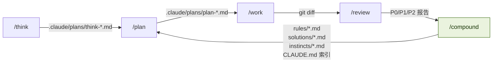
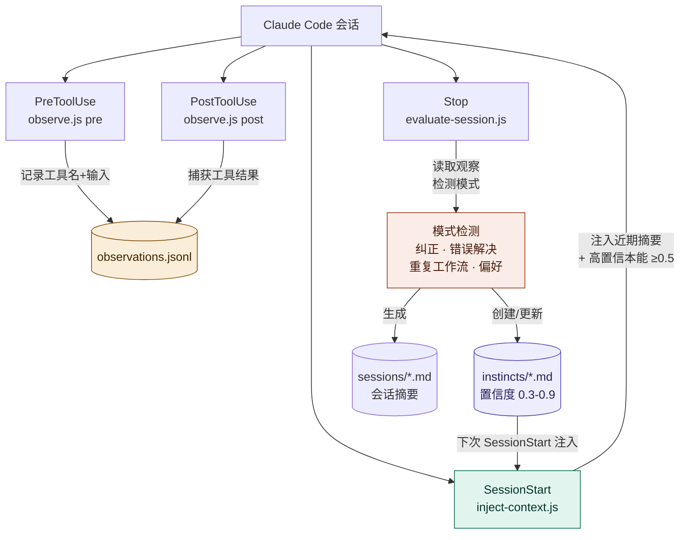
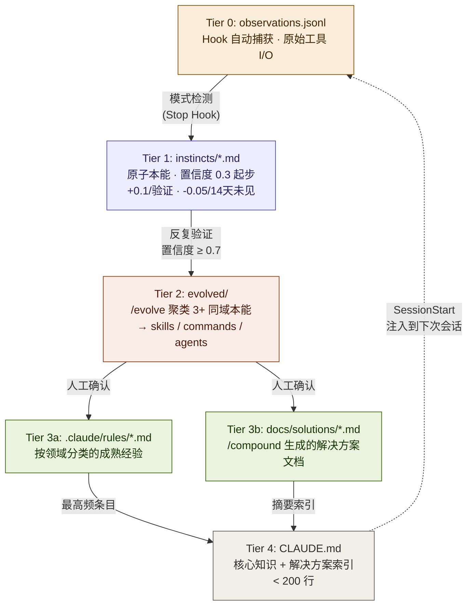
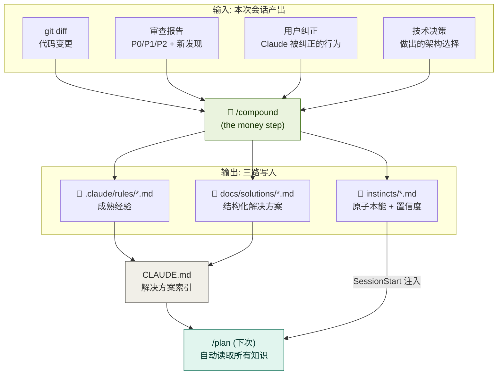
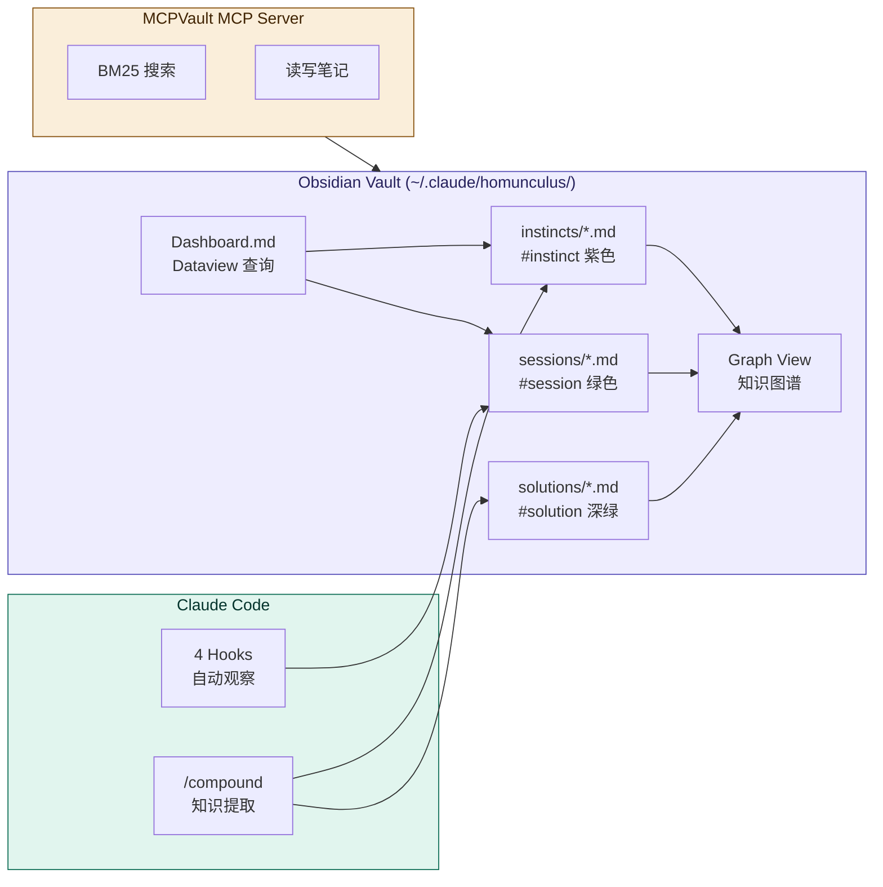
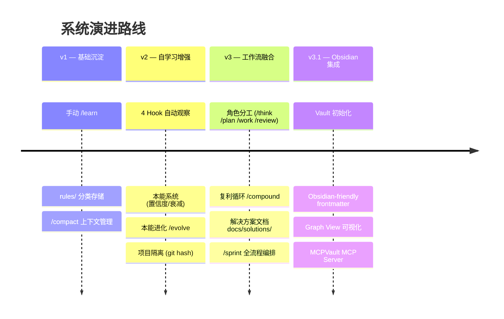

# Claude Code 自进化工程系统

> 融合 gstack 的角色分工 + Compound Engineering 的复利循环 + ECC/Claude-Mem 的自学习本能，
> 构建一套从规划到执行到知识积累的完整闭环。
> 每一次工作都让下一次更容易。

## 设计哲学

这套系统回答三个问题：

- **如何分工**（来自 gstack）：同一个模型在不同阶段切换角色——CEO 审视需求、架构师拆解方案、工程师逐步实现、审查团队多角度审查
- **如何复利**（来自 Compound Engineering）：每次工作的经验不蒸发，而是沉淀为可检索的解决方案文档，供下次规划自动读取
- **如何记忆**（来自 ECC + Claude-Mem）：4 个 Hook 自动观察每次工具调用，从中提取带置信度评分的原子化"本能"，本能会自动衰减、聚类、进化为永久知识

三层叠加、互不干涉：角色分工驱动执行，复利循环驱动流程，本能系统驱动记忆。

---

## 架构总览



---

## 执行流程：/sprint 全链路

`/sprint` 串联 5 个阶段，在关键决策点暂停等待确认。80% 时间花在规划和审查，20% 花在执行。



### 产出文件流



---

## 知识层：4 Hook 自动观察

系统通过 4 个 Hook 在后台持续运行，无需手动干预：



Hook 和手动命令的分工：Hook 抓表层模式（工具序列、重复操作），手动 `/compound` 提取深层知识（架构决策、bug 根因、设计选择）。两者互补。

---

## 知识生命周期：Tier 0 → Tier 4

知识从原始观察逐步提炼为核心智慧，反向回路通过 SessionStart 注入下次会话：



### 本能置信度

| 分数 | 含义 | 系统行为 |
|------|------|---------|
| 0.9+ | 核心行为 | 自动应用，视为确定规则 |
| 0.7-0.89 | 强模式 | SessionStart 自动注入 |
| 0.5-0.69 | 中等模式 | 相关场景出现时建议 |
| 0.3-0.49 | 初步观察 | 仅在被问到时提及 |
| < 0.3 | 衰减中 | 候选删除 |

提升：同一模式再次被观察 → +0.1（上限 0.95）
衰减：14 天未见 → -0.05（下限 0.1）
矛盾：新本能与旧本能冲突 → 旧本能 -0.1

---

## 复利闭环：/compound 完整数据流

`/compound` 是连接执行层和知识层的核心节点，也是整个系统"复利"的发生点：



---

## 快速安装

### 环境要求

- Node.js >= 18
- Git
- Claude Code CLI

### Windows（PowerShell）

```powershell
# 环境检查
node scripts\preflight.js

# 安装 v2 基础（本能系统 + Hook + 知识管理命令）
powershell -ExecutionPolicy Bypass -File .\install.ps1 -All

# 安装 v3 升级（工作流层 + 复利循环）
powershell -ExecutionPolicy Bypass -File .\upgrade-v3.ps1
```

### macOS / Linux

```bash
# 环境检查
node scripts/preflight.js

# 安装 v2 基础
bash install.sh --all

# 安装 v3 升级
bash upgrade-v3.sh
```

### 安装后
1. 编辑 `~/.claude/CLAUDE.md` 填写个人偏好
2. 编辑项目 `CLAUDE.md` 填写项目信息
3. 重启 Claude Code — Hook 自动生效

---

## 命令速查（15 个）

### 工作流命令（日常开发用）

| 命令 | 角色 | 作用 | 产出 |
|------|------|------|------|
| `/think` | CEO | 审视需求、锁定范围、定义验收条件 | `.claude/plans/think-*.md` |
| `/plan` | 架构师 | 技术方案、任务拆解、风险评估 | `.claude/plans/plan-*.md` |
| `/work` | 工程师 | 按计划逐步实现，每步测试验证 | git diff |
| `/review` | 审查团队 | 5 视角审查：安全/性能/架构/质量/测试 | P0/P1/P2 报告 |
| `/compound` | 知识管理 | 提取经验+本能+解决方案文档 | rules + solutions + instincts |
| `/sprint` | 指挥官 | 串联 think→plan→work→review→compound | 全部 |

### 知识管理命令

| 命令 | 作用 |
|------|------|
| `/learn` | 轻量经验提取（`/compound` 的子集，适合小改动） |
| `/debug-journal` | 记录完整调试过程（现象→误导→根因→解决→预防） |
| `/session-summary` | 生成会话总结报告 + 自动提取 |
| `/retrospective` | 全面回顾：经验审查 + 本能审计 + 观察归档 + 裁剪 |
| `/review-learnings` | 跨层搜索、统计、导出所有知识 |

### 本能系统命令

| 命令 | 作用 |
|------|------|
| `/instinct-status` | 查看本能面板（置信度、域分布、衰减预警） |
| `/evolve` | 将 3+ 个同域高置信本能聚类进化为 skill/command/agent |
| `/instinct-export` | 导出本能给团队（置信度 >= 0.5） |
| `/instinct-import` | 导入他人本能（自动降低 20% 置信度） |

---

## 使用节奏

```
大功能开发 (> 2 小时):
  /sprint '需求描述'
  → think(确认) → plan(确认) → work → review(确认) → compound

中等任务 (30 分钟 - 2 小时):
  /plan '任务描述' → 确认 → 开发 → /review → /compound

修 Bug:
  直接修 → /debug-journal → /compound

小改动 (< 30 分钟):
  直接改 → /compound (或 /learn)

探索调研:
  自由对话 → /learn
```

核心原则：**80% 规划+审查，20% 执行。先 /compound 再 /compact。**

---

## 目录结构

### 用户级（~/.claude/）— 跟着你走

```
~/.claude/
├── CLAUDE.md                           # 个人偏好 + 工程方法论 + 自学习规则
├── settings.json                       # 4 Hook 配置
├── commands/                           # 15 个全局命令
│   ├── think.md                        # /think (CEO)
│   ├── plan.md                         # /plan (Architect)
│   ├── work.md                         # /work (Engineer)
│   ├── review.md                       # /review (5-perspective)
│   ├── compound.md                     # /compound (money step)
│   ├── sprint.md                       # /sprint (full chain)
│   ├── learn.md                        # /learn (lightweight)
│   ├── review-learnings.md             # /review-learnings
│   ├── session-summary.md              # /session-summary
│   ├── instinct-status.md              # /instinct-status
│   ├── evolve.md                       # /evolve
│   ├── instinct-export.md              # /instinct-export
│   └── instinct-import.md              # /instinct-import
├── rules/
│   └── general-standards.md            # 通用编码标准
├── skills/
│   ├── memory/SKILL.md                 # 增强记忆管理
│   └── continuous-learning/
│       ├── SKILL.md                    # 自学习系统定义
│       └── hooks/                      # Hook 脚本
│           ├── observe.js              # PreToolUse/PostToolUse
│           ├── evaluate-session.js     # Stop
│           └── inject-context.js       # SessionStart
└── homunculus/                         # 知识存储 (Homunculus)
    ├── config.json                     # 系统配置
    ├── projects.json                   # 项目注册表
    ├── instincts/
    │   ├── personal/                   # 全局本能
    │   └── inherited/                  # 导入的本能
    ├── evolved/
    │   ├── skills/                     # 进化出的技能
    │   ├── commands/                   # 进化出的命令
    │   └── agents/                     # 进化出的代理
    └── projects/
        └── {git-remote-hash}/          # 按项目隔离
            ├── observations.jsonl      # 原始观察
            ├── instincts/              # 项目本能
            ├── sessions/               # 会话摘要
            └── evolved/                # 项目进化产物
```

### 项目级（.claude/）— 提交到 Git，团队共享

```
your-project/
├── CLAUDE.md                           # 项目核心知识库
├── .claude/
│   ├── settings.json                   # Hook 配置
│   ├── commands/
│   │   ├── learn.md                    # /learn (项目级)
│   │   ├── retrospective.md            # /retrospective
│   │   └── debug-journal.md            # /debug-journal
│   ├── rules/                          # 项目经验 (5 领域)
│   │   ├── architecture.md             # 架构决策记录
│   │   ├── debugging-gotchas.md        # 踩坑记录
│   │   ├── performance.md              # 性能优化经验
│   │   ├── testing-patterns.md         # 测试模式
│   │   └── api-conventions.md          # API 设计规范
│   └── plans/                          # /think 和 /plan 的产出
└── docs/
    └── solutions/                      # /compound 生成的解决方案文档
```

---

## 自学习触发策略

写入 CLAUDE.md 中的规则，确保 Claude 在适当时机自动触发学习：

**必须触发（不可跳过）：**
1. 解决了非平凡 bug（3+ 轮交互）→ `/debug-journal`
2. 用户纠正了 Claude 的行为 → 立即记录为本能
3. 做出了架构/技术决策 → 记录到 `rules/architecture.md`
4. 会话即将结束 → `/compound`

**建议触发：**
5. 发现非直觉行为、性能发现、重复工具序列 → 提示用户确认

**关键规则：永远先 /compound 再 /compact。**

---

## 健康指标

系统自动监控以下阈值：

| 指标 | 阈值 | 动作 |
|------|------|------|
| CLAUDE.md 行数 | > 200 行 | 迁移低频内容到 rules/ |
| 单个 rules 文件 | > 100 行 | 按子领域拆分 |
| 项目本能数量 | > 50 个 | 运行 /evolve 聚类 |
| 观察日志大小 | > 10 MB | 自动归档到 archive/ |
| 衰减本能数量 | > 10 个 | 运行 /retrospective 清理 |
| Rules 文件 30 天未更新 | — | 提醒回顾 |

---

## 与其他工具的兼容性

| 工具 | 关系 | 说明 |
|------|------|------|
| Superpowers | 完全兼容 | Superpowers 做 brainstorm/TDD 工作流，本系统做记忆 |
| Compound Engineering 插件 | 互补 | 可共存，/compound 比 /ce:compound 多了本能系统 |
| gstack | 互补 | 本系统的 /think /review 从 gstack 借鉴，但加了知识回写 |
| Claude-Mem | 可共存 | Claude-Mem 走 HTTP Worker，本系统走本地 JSONL，Hook 不冲突 |
| ECC | 建议二选一 | continuous-learning Hook 会重复，选一个即可 |

---

## 核心原则

1. **分层存储**：高频 → CLAUDE.md，分类 → rules/，原子 → instincts/，方案 → solutions/
2. **自动优先**：Hook 100% 捕获，手动命令只做深度提取
3. **复利导向**：每次 /compound 的产出直接成为下次 /plan 的输入
4. **质量把关**：本能有置信度，经验有格式规范，超阈值自动预警
5. **定期裁剪**：本能自动衰减，/retrospective 定期清理，CLAUDE.md < 200 行
6. **版本控制**：项目级配置全部提交 Git，`.claude/` + `docs/solutions/` 是团队共享资产
7. **80/20 分配**：80% 时间在规划和审查，20% 在执行

---

## Obsidian 知识图谱集成

系统产出的所有知识（本能、会话摘要、解决方案）可以通过 Obsidian 浏览和管理，利用 Graph View 可视化知识演化关系。



### 快速启用

```bash
# 初始化 Obsidian Vault
bash install.sh --obsidian          # macOS/Linux
.\install.ps1 -Obsidian             # Windows PowerShell

# 然后用 Obsidian 打开 ~/.claude/homunculus/
```

### 关键特性

| 特性 | 说明 |
|------|------|
| **自动流入** | Hook 产出的会话摘要、本能文件自动出现在 Vault 中 |
| **Graph View** | 按 tag 颜色区分知识类型（紫=本能，绿=会话，橙=规则） |
| **Dataview 查询** | Dashboard 提供高置信本能列表、近期会话等动态表格 |
| **Wikilinks** | 本能↔会话↔解决方案通过 `[[wikilinks]]` 互相关联 |
| **MCP Server** | 可选集成 MCPVault，让 Claude Code 直接读写 Vault |
| **零迁移** | 直接指向现有 `~/.claude/homunculus/` 目录，无需移动文件 |

详细文档：
- [安装指南](docs/obsidian-setup.md) — 环境要求、安装步骤、插件配置、故障排查
- [使用指南](docs/obsidian-usage.md) — 日常工作流、frontmatter 规范、Dataview 查询、知识维护

---

## 版本演进



| 版本 | 核心能力 | 来源 |
|------|---------|------|
| v1 | 手动 /learn + rules 分类存储 + compact 管理 | 原创 |
| v2 | 4 Hook 自动观察 + 本能系统(置信度/衰减/进化) + 项目隔离 | ECC + Claude-Mem |
| v3 | 角色分工 + Plan→Work→Review→Compound 复利循环 + /sprint 全流程 | gstack + Compound |
| v3.1 | Obsidian Vault 集成 + MCPVault + frontmatter tags/aliases/wikilinks | Obsidian + MCPVault |
