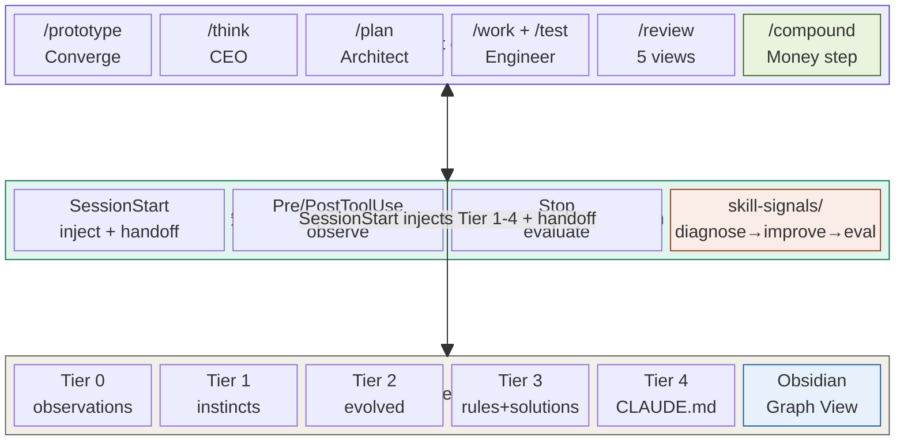
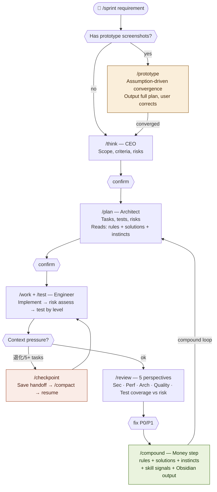
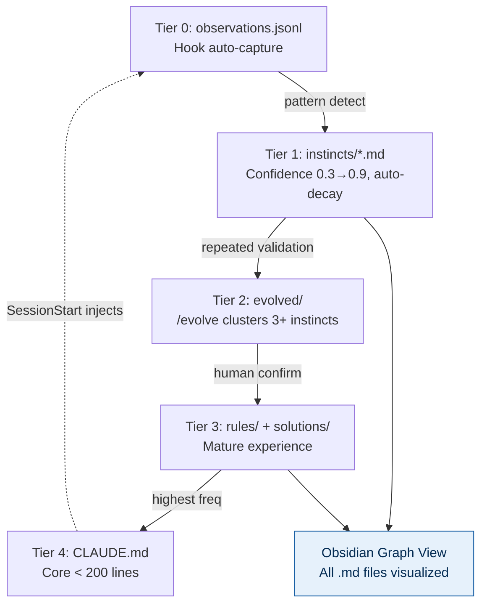
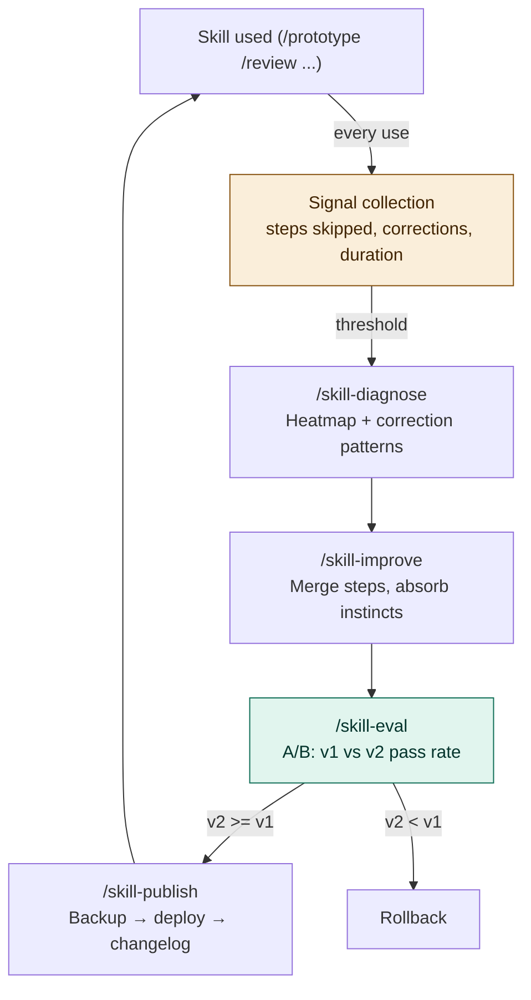
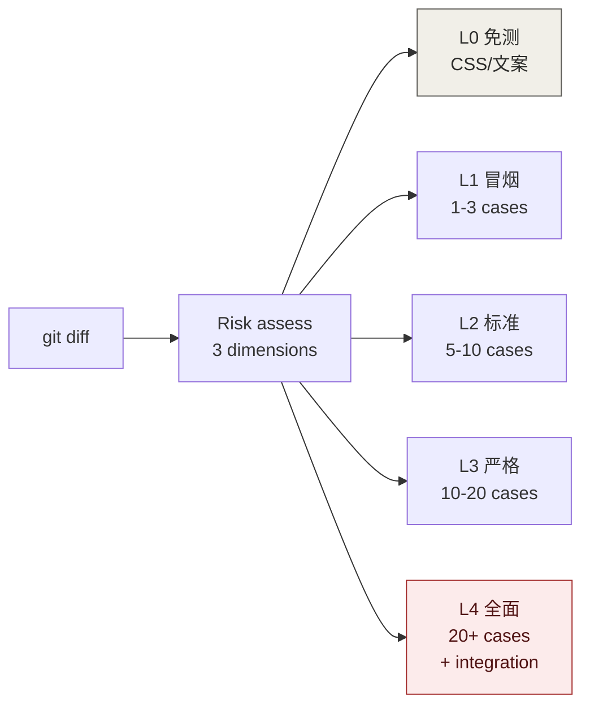
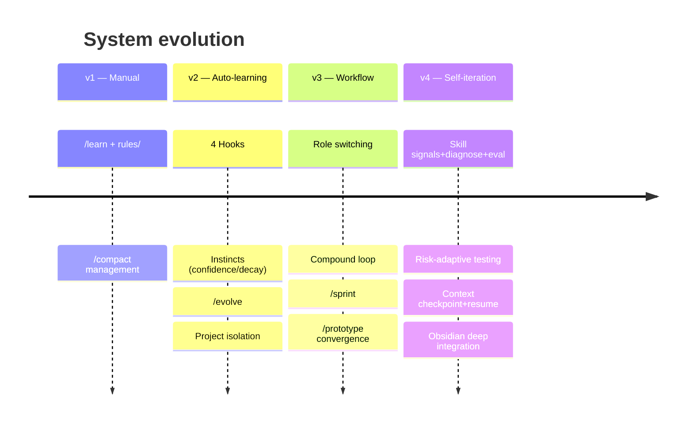

# Claude Code / Codex 自进化工程系统

> 融合 gstack 角色分工 + Compound Engineering 复利循环 + ECC/Claude-Mem 自学习本能 + Skill 自迭代 + 风险自适应测试 + 上下文交接 + Obsidian 知识图谱。
> 20 个用户命令 · 3 个项目命令 · 5 个按需技能 · 4 个 Hook · 5 层知识存储。
> 支持 Claude Code 原生目录和 Codex 原生插件两种运行时；每一次工作都让下一次更容易。

---

## 设计哲学

| 问题 | 来源 | 解法 |
|------|------|------|
| 如何分工 | gstack | 同一模型不同阶段切换角色（CEO→架构师→工程师→审查团队） |
| 如何复利 | Compound Engineering | 每次工作的经验沉淀为文档，供下次规划自动读取 |
| 如何记忆 | ECC + Claude-Mem | 4 Hook 自动观察，提取带置信度的"本能"，自动衰减和进化 |
| 如何适应 | Skill 自迭代 | 使用信号 → 诊断 → 改进提案 → eval 验证 → 发布新版 |
| 如何测试 | 风险自适应 | 评估变更风险等级(L0-L4)，自动匹配测试深度 |
| 如何持续 | 上下文交接 | 长任务 checkpoint + 交接文件 + 自动恢复 |
| 如何可视化 | Obsidian | 所有产出 Obsidian 兼容，Graph View 展示知识关联 |

---

## 架构总览



---

## 执行流程



---

## 知识生命周期



---

## Skill 自迭代



---

## 测试策略



---

## 安装

### 环境要求
Node.js >= 18 · Git · Claude Code CLI 或 Codex CLI

### Claude Code

Windows:
```powershell
node scripts\preflight.js
powershell -ExecutionPolicy Bypass -File .\install.ps1 -All
```

macOS/Linux:
```bash
node scripts/preflight.js && bash install.sh --all
```

### Codex

Codex 使用原生插件包 `plugins/tech-persistence/`，用户级安装会复制到 `~/plugins/tech-persistence` 并更新 `~/.agents/plugins/marketplace.json`。Codex 知识库默认写入 `~/.codex/homunculus`，可用 `TECH_PERSISTENCE_HOME` 覆盖。

当前 Codex CLI 的 TUI slash commands 只注册内置命令；插件工作流通过 skills 调用。Claude Code 中仍使用 `/sprint`、`/prototype`，Codex 中使用 `$sprint <需求>`、`$prototype <需求>`、`$plan <需求>`，也可以用 `@` picker 选择同名 skill。

Windows:
```powershell
node scripts\preflight.js --codex
powershell -ExecutionPolicy Bypass -File .\install-codex.ps1 -All
```

macOS/Linux:
```bash
node scripts/preflight.js --codex
bash install-codex.sh --all
```

迁移 Claude 历史知识库（可选）：
```powershell
powershell -ExecutionPolicy Bypass -File .\install-codex.ps1 -All -ImportClaude
```

```bash
bash install-codex.sh --all --import-claude
```

插件构建与验证：
```powershell
node plugins/tech-persistence/scripts/build-codex-plugin.js
node scripts/validate-codex-plugin.js
```

### Obsidian 集成（可选）
```powershell
.\install.ps1 -Obsidian     # 初始化 Obsidian vault
```
参考 `docs/obsidian-setup.md` 完成配置。

---

## 命令速查（23 个）

表中保留 Claude Code 的 `/command` 写法。Codex 中把前缀换成 `$`，例如 `/sprint` → `$sprint`、`/prototype` → `$prototype`。

### 工作流（7 个）
| 命令 | 角色 | 作用 |
|------|------|------|
| `/think` | CEO | 需求审视、范围锁定 |
| `/plan` | 架构师 | 任务拆解、风险评估 |
| `/work` | 工程师 | 按计划实现 + 按风险等级测试 |
| `/test` | 测试工程师 | 独立风险评估 + 分级测试 |
| `/review` | 审查团队 | 5 视角审查（含测试覆盖 vs 风险匹配） |
| `/compound` | 知识管理 | 经验+本能+方案+skill 信号+Obsidian 输出 |
| `/sprint` | 指挥官 | 全链路编排 + 自动 checkpoint + resume |

### 需求收敛（1 个）
| 命令 | 作用 |
|------|------|
| `/prototype` | 假设驱动：输出完整方案，用户只纠偏不对的部分 |

### 上下文管理（1 个）
| 命令 | 作用 |
|------|------|
| `/checkpoint` | 保存 sprint 状态到交接文件，为上下文重置做准备 |

### 知识管理（5 个）
| 命令 | 作用 |
|------|------|
| `/learn` | 轻量经验提取（/compound 子集） |
| `/debug-journal` | 调试全过程 + 自动回归测试 |
| `/session-summary` | 会话总结报告 |
| `/retrospective` | 全面回顾 + skill 诊断 |
| `/review-learnings` | 跨层搜索统计 |

### 本能系统（4 个）
| 命令 | 作用 |
|------|------|
| `/instinct-status` | 本能面板 |
| `/evolve` | 本能聚类进化 |
| `/instinct-export` | 导出本能 |
| `/instinct-import` | 导入本能 |

### Skill 自迭代（4 个）
| 命令 | 作用 |
|------|------|
| `/skill-diagnose` | 诊断 skill 健康 |
| `/skill-improve` | 生成改进提案 |
| `/skill-eval` | A/B 验证 |
| `/skill-publish` | 发布新版 + changelog |

### 项目级（3 个）
| 命令 | 作用 |
|------|------|
| `/learn` (项目级) | 项目特有经验提取 |
| `/debug-journal` | 项目调试日志 |
| `/retrospective` | 项目回顾 + skill 诊断 |

---

## 使用节奏

Codex 中使用同名 `$skill` 入口；例如下面的 `/sprint` 在 Codex 中输入 `$sprint`。

```
大功能 (>2h):     /sprint '需求' → auto checkpoint if needed
原型驱动:         /prototype → 纠偏 → /plan → /work → /prototype compare
中等任务:         /plan → /work → /review → /compound
修 Bug:           修 → /debug-journal → /compound
小改动:           改 → /compound
探索:             对话 → /learn
月度维护:         /retrospective (含 skill 诊断)
Skill 优化:       /skill-diagnose → /skill-improve → /skill-eval → /skill-publish
长任务中断:       /checkpoint → /compact → 下次 /sprint resume
```

---

## 自动化 Hook

| Hook | 脚本 | 作用 |
|------|------|------|
| SessionStart | inject-context.js | 注入本能 + 会话摘要 + 检测 handoff/prototype 状态 |
| PreToolUse | observe.js pre | 记录工具输入 |
| PostToolUse | observe.js post | 捕获工具结果 |
| Stop | evaluate-session.js | 模式检测 + 本能提取 + 衰减 |

---

## 按需加载技能（5 个）

| 技能 | 触发条件 | 加载内容 |
|------|---------|---------|
| memory | 涉及记忆管理 | 增强记忆方法论 |
| continuous-learning | 系统说明需要时 | 自学习系统定义 |
| prototype-workflow | 上传原型截图 | 假设驱动收敛方法论 |
| test-strategy | 代码变更/测试 | 风险评估矩阵 + 五级测试深度 |
| context-handoff | sprint 中上下文压力 | checkpoint + 交接文件方法论 |

不触发时不加载，零上下文占用。

---

## 测试策略

| 等级 | 适用 | 用例数 | 耗时占比 |
|------|------|--------|---------|
| L0 免测 | 样式/文案/注释 | 0 | 0% |
| L1 冒烟 | 低风险新增 | 1-3 | 10% |
| L2 标准 | 常规开发 | 5-10 | 20-30% |
| L3 严格 | 核心逻辑/API | 10-20 | 40-50% |
| L4 全面 | 支付/认证/数据迁移 | 20+ | 60%+ |

风险评估自动完成（影响面 × 可逆性 × 变更类型），用户只在不对时纠偏。

---

## Obsidian 集成

所有知识产出统一使用 Obsidian 兼容格式（frontmatter + wikilinks + tags）。

| 产出 | Tag | Graph 颜色 | 产生方式 |
|------|-----|-----------|---------|
| 本能 | `#instinct` | 紫色 | Hook + /compound |
| 会话 | `#session` | 绿色 | Stop Hook |
| 解决方案 | `#solution` | 深绿 | /compound |
| 规则 | `#rule` | 橙色 | /compound /learn |
| 架构 | `#architecture` | 红色 | /compound |
| Sprint | `#sprint` | 青色 | /sprint |
| 交接点 | `#handoff` | 金色 | /checkpoint |

详细配置见 `docs/obsidian-setup.md`，使用方法见 `docs/obsidian-usage.md` 和 `docs/obsidian-sprint-usage.md`。

---

## 本能置信度

| 分数 | 行为 | 提升 | 衰减 |
|------|------|------|------|
| 0.9+ | 自动应用 | +0.1/验证 | -0.05/14天 |
| 0.7+ | SessionStart 注入 | | |
| 0.5+ | 相关时建议 | | |
| 0.3+ | 被问到时提及 | | |
| <0.3 | 候选删除 | | |

---

## 目录结构

```
~/.claude/                              ← 用户级 (跟着你走)
├── CLAUDE.md                           ← 核心偏好 + 路由规则 (< 200行)
├── settings.json                       ← 4 Hook 配置
├── commands/ (20 个)                   ← 全部用户命令
├── rules/general-standards.md
├── skills/                             ← 5 个按需加载技能
│   ├── memory/
│   ├── continuous-learning/{SKILL.md, hooks/}
│   ├── prototype-workflow/
│   ├── test-strategy/
│   └── context-handoff/
└── homunculus/                         ← 知识存储
    ├── instincts/{personal/, inherited/}
    ├── evolved/{skills/, commands/, agents/}
    ├── skill-signals/                  ← 使用信号
    ├── skill-evals/                    ← 测试集
    ├── skill-changelog/                ← 变更记录
    └── projects/{hash}/

your-project/                           ← 项目级 (提交 Git)
├── CLAUDE.md
├── .claude/{commands/, rules/, plans/}
└── docs/
    ├── solutions/                      ← /compound 产出
    └── plans/                          ← /sprint + /checkpoint 产出

plugins/tech-persistence/               ← Codex 原生插件包
├── .codex-plugin/plugin.json
├── commands/                            ← 20 个兼容命令源文件
├── skills/                              ← 5 个按需技能 + 20 个 command skill wrappers
├── hooks.json                           ← 4 Hook 配置
├── hooks/                               ← Codex runtime hook scripts
├── scripts/                             ← build/import utilities
└── codex-homunculus-template/

Codex 调用方式：
`$sprint <需求>`、`$prototype <需求>`、`$plan <需求>`，或用 `@` 选择同名 skill。
当前 Codex CLI 会把 `/sprint` 和 `/tech-persistence:sprint` 当作未知 TUI slash command。

~/.codex/                              ← Codex 用户级 (与 ~/.claude 对齐)
├── AGENTS.md                           ← 核心偏好 + 路由规则
├── commands/ (20 个)                   ← 兼容命令源文件
├── rules/general-standards.md
├── skills/                             ← 5 个按需技能 + 20 个 command skill wrappers
│   ├── memory/
│   ├── continuous-learning/{SKILL.md, hooks/}
│   ├── prototype-workflow/
│   ├── test-strategy/
│   ├── context-handoff/
│   └── sprint/, prototype/, plan/, work/, review/, ...
└── homunculus/                         ← Codex 用户级知识存储
    └── projects/{hash}/

your-project/                           ← Codex 项目级 (提交 Git)
├── AGENTS.md
├── .codex/{commands/, rules/, plans/, skills/}
└── docs/solutions/
```

---

## 健康指标

| 指标 | 阈值 | 动作 |
|------|------|------|
| CLAUDE.md | > 200 行 | 迁移到 rules/ |
| rules 文件 | > 100 行 | 拆分 |
| 本能数量 | > 50 | /evolve |
| 观察日志 | > 10 MB | 归档 |
| Skill 放弃率 | > 30% | /skill-diagnose |
| Skill 纠正 | 3+ 次 | /skill-diagnose |
| Sprint 中 Task > 5 | — | 建议 /checkpoint |
| 会话轮次 > 30 | — | 建议 /checkpoint |

---

## 核心原则

1. **分层存储**：高频→CLAUDE.md/AGENTS.md · 分类→rules/ · 原子→instincts/ · 方案→solutions/
2. **分层加载**：CLAUDE.md/AGENTS.md 路由 · skill 按需 · rules 路径匹配
3. **假设驱动**：输出方案让用户纠偏，不做冗长问答
4. **风险自适应**：测试深度跟着变更风险走，不多不少
5. **自动优先**：Hook 100% 捕获 · 手动命令做深度提取
6. **复利导向**：/compound 产出 → 下次 /plan 自动读取
7. **Skill 进化**：使用信号 → 诊断 → 验证 → 发布
8. **上下文安全**：长任务自动 checkpoint，不怕上下文溢出
9. **Obsidian 原生**：所有产出 frontmatter + wikilinks，Graph View 可视化
10. **80/20 分配**：80% 规划审查 · 20% 执行
11. **先学后压**：永远先 /compound 再 /compact

---

## 版本演进


