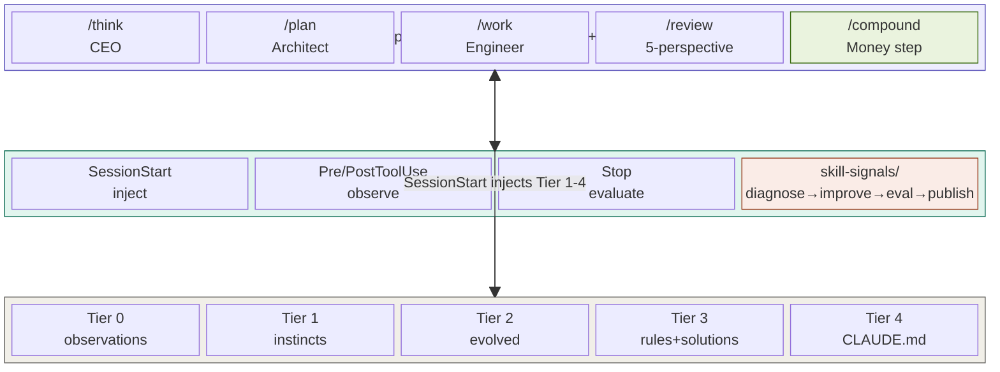
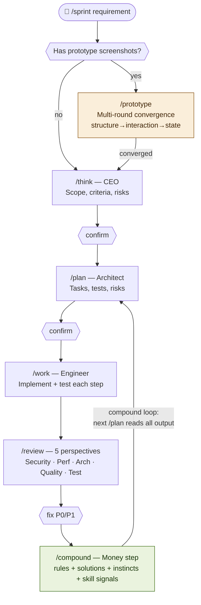
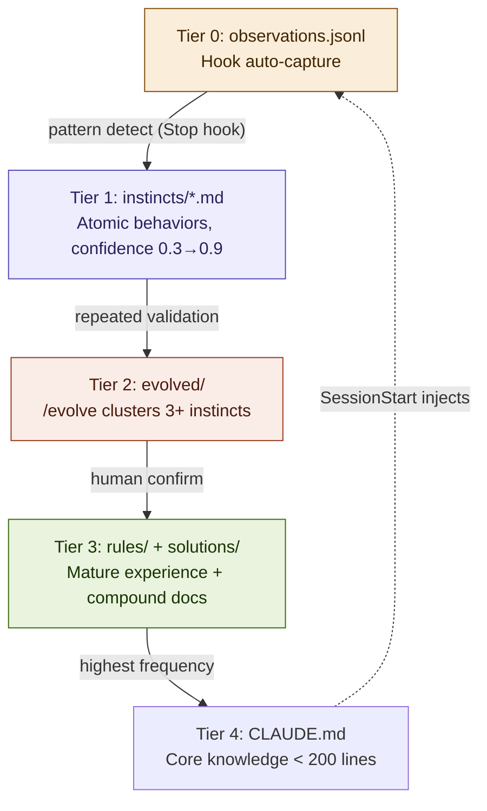
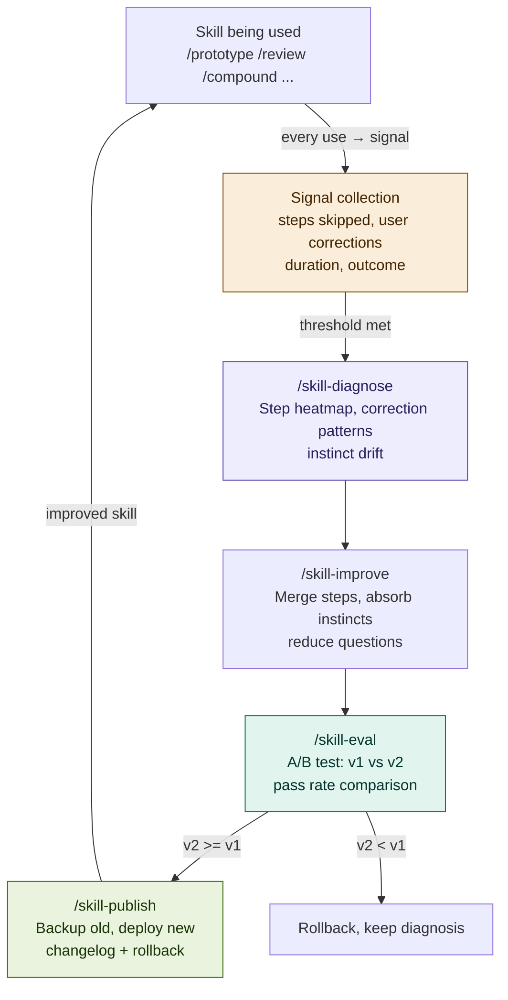
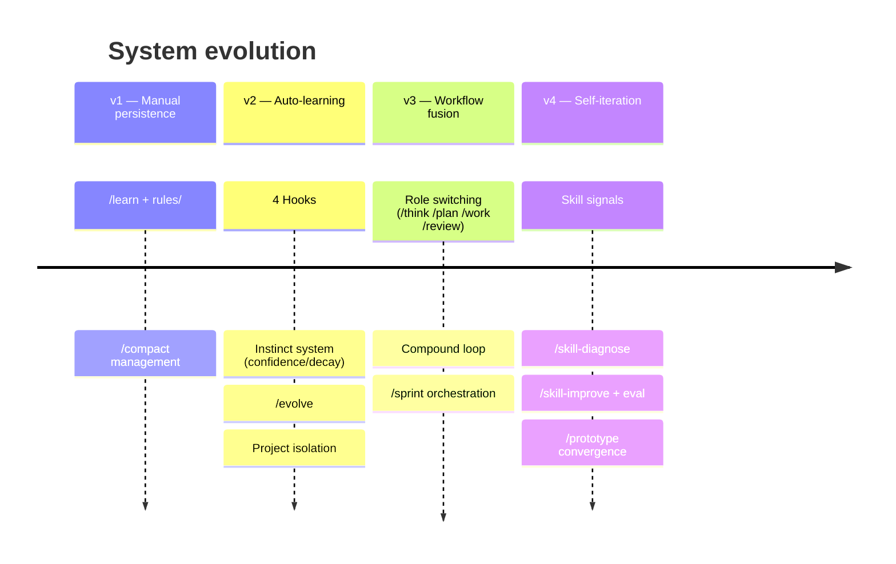

# Claude Code 自进化工程系统

> 融合 gstack 角色分工 + Compound Engineering 复利循环 + ECC/Claude-Mem 自学习本能 + Skill 自迭代。
> 19 个命令 · 4 个 Hook · 5 层知识存储 · Skill 自动进化。
> 每一次工作都让下一次更容易。

---

## 设计哲学

| 问题 | 来源 | 解法 |
|------|------|------|
| 如何分工 | gstack | 同一模型在不同阶段切换角色（CEO→架构师→工程师→审查团队） |
| 如何复利 | Compound Engineering | 每次工作的经验沉淀为可检索的文档，供下次规划自动读取 |
| 如何记忆 | ECC + Claude-Mem | 4 Hook 自动观察，提取带置信度的原子化"本能"，自动衰减和进化 |
| 如何适应 | Skill 自迭代 | Skill 使用信号 → 诊断 → 改进提案 → eval 验证 → 发布新版 |

---

## 架构总览



---

## 执行流程



---

## 知识生命周期



---

## Skill 自迭代闭环



---

## 安装

### 环境要求
Node.js >= 18 · Git · Claude Code CLI

### Windows
```powershell
node scripts\preflight.js
powershell -ExecutionPolicy Bypass -File .\install.ps1 -All
```

### macOS/Linux
```bash
node scripts/preflight.js
bash install.sh --all
```

安装后编辑 `~/.claude/CLAUDE.md` 填写个人偏好，重启 Claude Code。

---

## 命令速查（19 个）

### 工作流（6 个）
| 命令 | 角色 | 作用 |
|------|------|------|
| `/think` | CEO | 需求审视、范围锁定 |
| `/plan` | 架构师 | 任务拆解、风险评估 |
| `/work` | 工程师 | 按计划实现、每步测试 |
| `/review` | 审查团队 | 5 视角审查 |
| `/compound` | 知识管理 | 经验+本能+方案+skill 信号 |
| `/sprint` | 指挥官 | 串联 think→plan→work→review→compound |

### 需求收敛（1 个）
| 命令 | 作用 |
|------|------|
| `/prototype` | 原型截图多轮收敛（结构→交互→状态→技术） |

### 知识管理（5 个）
| 命令 | 作用 |
|------|------|
| `/learn` | 轻量经验提取 |
| `/debug-journal` | 调试全过程记录 |
| `/session-summary` | 会话总结报告 |
| `/retrospective` | 全面回顾 + skill 诊断 |
| `/review-learnings` | 跨层搜索统计 |

### 本能系统（4 个）
| 命令 | 作用 |
|------|------|
| `/instinct-status` | 本能面板 |
| `/evolve` | 本能聚类进化 |
| `/instinct-export` | 导出本能 |
| `/instinct-import` | 导入本能 |

### Skill 自迭代（3 个）
| 命令 | 作用 |
|------|------|
| `/skill-diagnose` | 诊断 skill 健康（信号分析+热力图） |
| `/skill-improve` | 生成改进提案（合并/精简/吸收本能） |
| `/skill-eval` | A/B 验证提案 |

---

## 使用节奏

```
大功能 (>2h):  /sprint '需求'
中等任务:      /plan → /work → /review → /compound
原型驱动:      /prototype → (收敛) → /plan → /work → /prototype compare → /compound
修 Bug:        修 → /debug-journal → /compound
小改动:        改 → /compound
探索:          对话 → /learn
月度维护:      /retrospective (含 skill 诊断)
Skill 优化:    /skill-diagnose → /skill-improve → /skill-eval → /skill-publish
```

---

## 自动化 Hook

| Hook | 脚本 | 作用 |
|------|------|------|
| SessionStart | inject-context.js | 注入近期摘要 + 高置信本能 |
| PreToolUse | observe.js pre | 记录工具输入 |
| PostToolUse | observe.js post | 捕获工具结果 |
| Stop | evaluate-session.js | 模式检测 + 本能提取 + 衰减 |

---

## 本能置信度

| 分数 | 行为 | 提升 | 衰减 |
|------|------|------|------|
| 0.9+ | 自动应用 | +0.1/验证 | -0.05/14天 |
| 0.7+ | SessionStart 注入 | | |
| 0.5+ | 相关时建议 | | |
| 0.3+ | 被问到时提及 | | |
| <0.3 | 候选删除 | | |

---

## 目录结构

```
~/.claude/                              ← 用户级
├── CLAUDE.md                           ← 核心偏好 + 路由规则 (< 200行)
├── settings.json                       ← 4 Hook
├── commands/ (19 个)                   ← 所有命令
├── rules/general-standards.md          ← 通用标准
├── skills/
│   ├── memory/SKILL.md
│   ├── continuous-learning/{SKILL.md, hooks/}
│   └── prototype-workflow/SKILL.md     ← 按需加载
└── homunculus/
    ├── config.json
    ├── instincts/{personal/, inherited/}
    ├── evolved/{skills/, commands/, agents/}
    ├── skill-signals/                  ← NEW: 使用信号
    ├── skill-evals/                    ← NEW: 测试集
    ├── skill-changelog/                ← NEW: 变更记录
    └── projects/{hash}/

your-project/                           ← 项目级 (提交 Git)
├── CLAUDE.md
├── .claude/{commands/, rules/, plans/}
└── docs/solutions/                     ← /compound 产出
```

---

## 健康指标

| 指标 | 阈值 | 动作 |
|------|------|------|
| CLAUDE.md | > 200 行 | 迁移到 rules/ |
| rules 文件 | > 100 行 | 拆分 |
| 本能数量 | > 50 | /evolve |
| 观察日志 | > 10 MB | 归档 |
| Skill 放弃率 | > 30% | /skill-diagnose |
| Skill 纠正 | 3+ 次 | /skill-diagnose |
| 待吸收本能 | 5+ 个 | /skill-improve --absorb |

---

## 核心原则

1. **分层存储**：高频→CLAUDE.md · 分类→rules/ · 原子→instincts/ · 方案→solutions/
2. **分层加载**：CLAUDE.md 路由规则 · skill 按需加载 · rules 路径匹配
3. **自动优先**：Hook 100% 捕获 · 手动命令做深度提取
4. **复利导向**：/compound 产出 → 下次 /plan 自动读取
5. **Skill 进化**：使用信号 → 诊断 → 改进 → 验证 → 发布
6. **质量把关**：本能有置信度 · 经验有格式 · Skill 有 eval
7. **80/20 分配**：80% 规划审查 · 20% 执行
8. **先学后压**：永远先 /compound 再 /compact

---

## 版本演进


