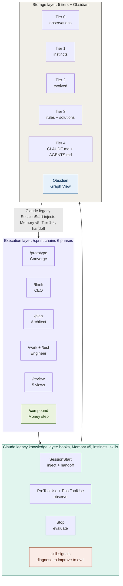
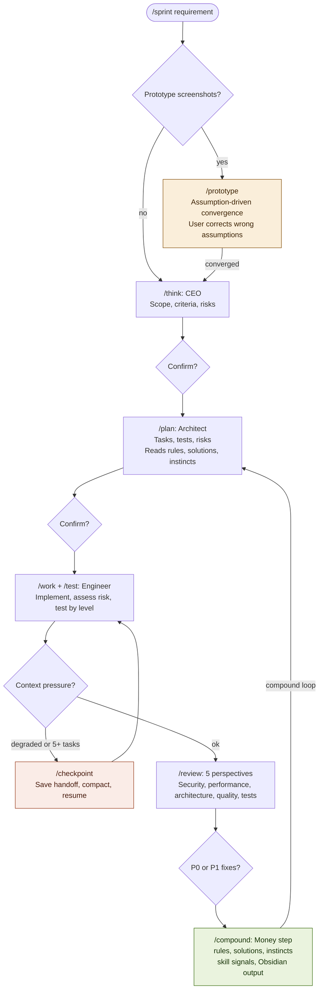
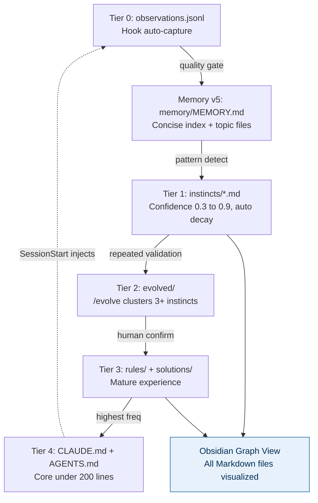
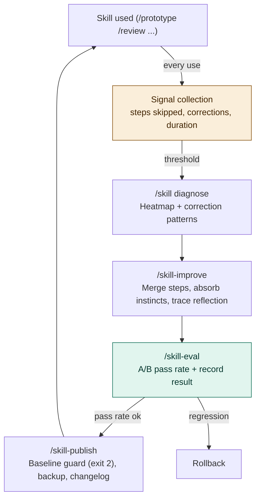
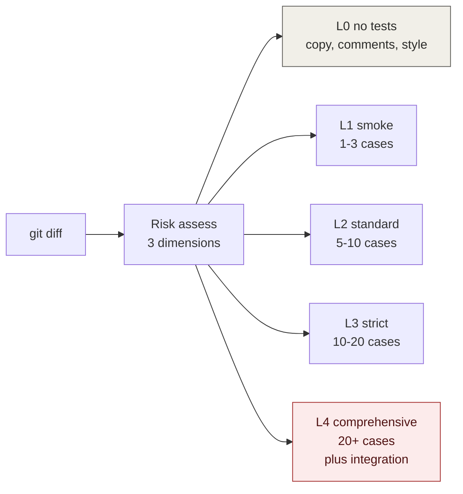

# Tech Persistence

> Persistent engineering memory for Claude Code and Codex.
> Claude Code 和 Codex 的长期工程记忆层。

**Stop teaching your AI agent the same repo twice.**
**别再一遍遍教 AI 认识同一个项目。**

AI coding agent 很强，但它会忘。每次新 session 都可能需要重新解释项目架构、踩过的坑、review 规则、测试习惯和交接上下文。

Tech Persistence turns every sprint into durable engineering memory. The next Claude Code or Codex session starts with what the last one learned.

Tech Persistence 把每一次 sprint 沉淀成持久化工程记忆，让下一次 Claude Code / Codex session 带着上一次学到的东西开始。

Start with `/sprint`. Go deeper with `/think`, `/plan`, `/work`, `/review`, `/compound` when needed.

## 最小示例

```bash
/sprint "fix the flaky auth test and prevent this failure pattern from recurring"
/review
/compound
```

- `/sprint` 完成规划、实现、测试、审查和复盘
- hooks 捕获 session 中的有价值信号
- `/compound` 把经验沉淀为可复用记忆
- 下一次 session 自动注入相关项目知识

## 核心价值

| 价值 | 说明 |
|------|------|
| 长期项目记忆 | 架构约定、踩坑记录、review 规则和测试偏好不再每次重讲 |
| Sprint 复利 | 每次实现、修 bug、review 都能沉淀为下一次可用的工程知识 |
| 跨 Agent 连续性 | Claude Code 和 Codex 可以从同一套项目记忆开始工作 |
| 可追溯知识层 | 记忆来自 session 信号、复盘文档和规则文件，能读、能审、能同步 |

---

## 架构总览


```mermaid
flowchart TD
    subgraph EXEC["Execution layer: /sprint chains 6 phases"]
        direction LR
        PROTOTYPE["/prototype<br/>Converge"]
        THINK["/think<br/>CEO"]
        PLAN["/plan<br/>Architect"]
        WORK["/work + /test<br/>Engineer"]
        REVIEW["/review<br/>5 views"]
        COMPOUND["/compound<br/>Money step"]
    end

    subgraph KNOW["Claude legacy knowledge layer: hooks, Memory v5, instincts, skills"]
        direction LR
        SESSION_START["SessionStart<br/>inject + handoff"]
        TOOL_HOOKS["PreToolUse + PostToolUse<br/>observe"]
        STOP_HOOK["Stop<br/>evaluate"]
        SKILL_SIGNALS["skill-signals<br/>diagnose to improve to eval"]
    end

    subgraph STORE["Storage layer: 5 tiers + Obsidian"]
        direction LR
        TIER_0["Tier 0<br/>observations"]
        TIER_1["Tier 1<br/>instincts"]
        TIER_2["Tier 2<br/>evolved"]
        TIER_3["Tier 3<br/>rules + solutions"]
        TIER_4["Tier 4<br/>CLAUDE.md + AGENTS.md"]
        OBSIDIAN["Obsidian<br/>Graph View"]
    end

    EXEC --> KNOW
    KNOW --> STORE
    STORE -->|"Claude legacy SessionStart injects Memory v5, Tier 1-4, handoff"| EXEC

    style EXEC fill:#EEEDFE,stroke:#534AB7,color:#26215C
    style KNOW fill:#E1F5EE,stroke:#0F6E56,color:#04342C
    style STORE fill:#F1EFE8,stroke:#5F5E5A,color:#2C2C2A
    style COMPOUND fill:#EAF3DE,stroke:#3B6D11,color:#173404
    style SKILL_SIGNALS fill:#FAECE7,stroke:#993C1D,color:#4A1B0C
    style OBSIDIAN fill:#E6F1FB,stroke:#185FA5,color:#042C53
```

---

## 执行流程


```mermaid
flowchart TD
    START(["/sprint requirement"])
    START --> PROTO

    PROTO{"Prototype screenshots?"}
    PROTO -->|"yes"| PROTOTYPE["/prototype<br/>Assumption-driven convergence<br/>User corrects wrong assumptions"]
    PROTO -->|"no"| THINK

    PROTOTYPE -->|"converged"| THINK
    THINK["/think: CEO<br/>Scope, criteria, risks"] --> C1{"Confirm?"}
    C1 --> PLAN["/plan: Architect<br/>Tasks, tests, risks<br/>Reads rules, solutions, instincts"]
    PLAN --> C2{"Confirm?"}
    C2 --> WORK["/work + /test: Engineer<br/>Implement, assess risk, test by level"]

    WORK --> CPCHECK{"Context pressure?"}
    CPCHECK -->|"degraded or 5+ tasks"| CHECKPOINT["/checkpoint<br/>Save handoff, compact, resume"]
    CHECKPOINT --> WORK
    CPCHECK -->|"ok"| REVIEW

    REVIEW["/review: 5 perspectives<br/>Security, performance, architecture, quality, tests"]
    REVIEW --> C3{"P0 or P1 fixes?"}
    C3 --> COMPOUND["/compound: Money step<br/>rules, solutions, instincts<br/>skill signals, Obsidian output"]
    COMPOUND -->|"compound loop"| PLAN

    style PROTOTYPE fill:#FAEEDA,stroke:#854F0B,color:#412402
    style COMPOUND fill:#EAF3DE,stroke:#3B6D11,color:#173404
    style CHECKPOINT fill:#FAECE7,stroke:#993C1D,color:#4A1B0C
```

---

## 知识生命周期

下图描述 Claude legacy hooks 的自动捕获/注入链。Codex 共享相同存储格式，并由当前原生 hooks 自动采集受治理的 prompt/tool/Stop 行为事件；知识读取仍按需进行，候选审批、promotion 与验证后的知识沉淀仍经过显式 Compound/治理 gate。


```mermaid
flowchart TD
    T0["Tier 0: observations.jsonl<br/>Hook auto-capture"]
    M0["Memory v5: memory/MEMORY.md<br/>Concise index + topic files"]
    T1["Tier 1: instincts/*.md<br/>Confidence 0.3 to 0.9, auto decay"]
    T2["Tier 2: evolved/<br/>/evolve clusters 3+ instincts"]
    T3["Tier 3: rules/ + solutions/<br/>Mature experience"]
    T4["Tier 4: CLAUDE.md + AGENTS.md<br/>Core under 200 lines"]
    OBS["Obsidian Graph View<br/>All Markdown files visualized"]

    T0 -->|"quality gate"| M0
    M0 -->|"pattern detect"| T1
    T1 -->|"repeated validation"| T2
    T2 -->|"human confirm"| T3
    T3 -->|"highest freq"| T4
    T4 -.->|"SessionStart injects"| T0
    T1 --> OBS
    T3 --> OBS

    style OBS fill:#E6F1FB,stroke:#185FA5,color:#042C53
```

---

## Skill 自迭代


```mermaid
flowchart TD
    USE["Skill used (/prototype /review ...)"]
    SIG["Signal collection<br/>steps skipped, corrections, duration"]
    DIAG["/skill diagnose<br/>Heatmap + correction patterns"]
    IMP["/skill-improve<br/>Merge steps, absorb instincts, trace reflection"]
    EVAL["/skill-eval<br/>A/B pass rate + record result"]
    PUB["/skill-publish<br/>Baseline guard (exit 2), backup, changelog"]

    USE -->|"every use"| SIG
    SIG -->|"threshold"| DIAG
    DIAG --> IMP
    IMP --> EVAL
    EVAL -->|"pass rate ok"| PUB
    EVAL -->|"regression"| ROLL["Rollback"]
    PUB --> USE

    style SIG fill:#FAEEDA,stroke:#854F0B,color:#412402
    style EVAL fill:#E1F5EE,stroke:#0F6E56,color:#04342C
```

---

## 测试策略


```mermaid
flowchart LR
    DIFF["git diff"] --> ASSESS["Risk assess<br/>3 dimensions"]
    ASSESS --> L0["L0 no tests<br/>copy, comments, style"]
    ASSESS --> L1["L1 smoke<br/>1-3 cases"]
    ASSESS --> L2["L2 standard<br/>5-10 cases"]
    ASSESS --> L3["L3 strict<br/>10-20 cases"]
    ASSESS --> L4["L4 comprehensive<br/>20+ cases<br/>plus integration"]

    style L0 fill:#F1EFE8,stroke:#5F5E5A,color:#2C2C2A
    style L4 fill:#FCEBEB,stroke:#A32D2D,color:#501313
```

---

## 安装

### 环境要求
Node.js >= 18 · Git · Claude Code CLI 或 Codex CLI

### 统一安装（Windows 推荐）

同时覆盖 legacy Claude Code、Codex、Claude Code plugin 三个安装面：

```powershell
powershell -ExecutionPolicy Bypass -File .\install-all.ps1 -All
```

排查时可以只跳过某个安装面：

```powershell
powershell -ExecutionPolicy Bypass -File .\install-all.ps1 -All -SkipPlugin
powershell -ExecutionPolicy Bypass -File .\install-all.ps1 -All -DryRun
```

### Claude Code

Windows:
```powershell
node scripts\preflight.js
powershell -ExecutionPolicy Bypass -File .\install.ps1 -All
node scripts\validate-claude-install.js --project
```

macOS/Linux:
```bash
node scripts/preflight.js && bash install.sh --all
node scripts/validate-claude-install.js --project
```

### Codex

Codex 使用原生插件包 `plugins/tech-persistence/`，用户级安装会复制到 `~/plugins/tech-persistence` 并更新 `~/.agents/plugins/marketplace.json`。Codex 知识库默认写入 `~/.codex/homunculus`，可用 `TECH_PERSISTENCE_HOME` 临时覆盖，也可用 `~/.tech-persistence/config.json` 配置持续共享目录。

Codex 插件的原生入口是 `$skill` 或 `@` picker。用户级安装器还为 `/think`、`/plan`、`/work`、`/review`、`/compound`、`/sprint` 安装薄兼容入口，它们路由到同一套 Codex-native skill；其余工作流使用 `$prototype`、`$agent-loop`、`$caveman` 等 skill。Claude Code plugin 使用原生 skill 命名空间，例如 `/tech-persistence:sprint`；只有 Claude classic 用户级安装仍使用未命名空间的 `/sprint`。

Windows:
```powershell
node scripts\preflight.js --codex
powershell -ExecutionPolicy Bypass -File .\install-codex.ps1 -All
```

macOS/Linux:
```bash
node scripts/preflight.js --codex
bash install-codex.sh --all
```

### 架构感知项目规范

Claude 与 Codex 的项目安装器会调用同一个 resolver，从真实依赖、源码入口、workspace 和部署资产中组合
`base`、`frontend`、`backend`、`agent`、`data`、`infrastructure`、`library`、`monorepo`、
`fullstack` 或 `unknown` profile。结果分别写入 `.claude/project-standards.json` 与
`.codex/project-standards.json`；两端 rules、project-local skill 和 command compatibility asset 都由
`project-level/` 的单一 canonical catalog 生成并进行 SHA-256 校验。

```powershell
# 只读查看检测证据
node scripts\project-standards.js --detect-only --json

# 查看 create/update/retire/conflict、入口和 LF 属性计划，不写文件
node scripts\project-standards.js --dry-run --runtime both --json

# 首次自动检测并安装；既有 explicit 选择会在后续安装器更新中保持
node scripts\project-standards.js --runtime both --profiles auto

# 架构不完整时显式覆盖；fullstack 会展开为 frontend + backend
node scripts\project-standards.js --runtime both --profiles frontend,agent

# 用户明确要求放弃 explicit 选择时，才恢复自动检测
node scripts\project-standards.js --runtime both --profiles auto --refresh-auto

# 独立校验 manifest、hash、入口路由和双运行时 parity
node scripts\project-standards.js --check --runtime both
```

安装器只更新其上次写入且 hash 未漂移的文件；用户修改或同名自有文件会作为 conflict 保留并使安装失败。
已不再适用、且仍与上次受管 hash 一致的 profile 文件会移动到 runtime 内的备份目录，而不是直接删除。
catalog 删除或重命名逻辑资产时，先以 `retiredAssets` tombstone 记录原 identity 与双运行时 hashes，旧项目才能
证明所有权并做可恢复退休；不得直接删掉历史 identity。
入口路由或 LF block 合法升级时，同样先把旧 marker hash 加入 `legacyMarkerHashes`；只有目标块、旧 manifest
与 catalog allowlist 三者一致时才会 CAS 更新。
resolver 会在项目根 `.gitattributes` 末尾维护冲突安全的 LF block，使 Windows fresh checkout 后的原始字节
SHA-256 仍稳定；既有用户属性保留。`.env*`、凭据/私钥、VCS 元数据、依赖/缓存目录、
`settings.local.*`、symlink、空 Skill、lock、session 与 PID 文件不会进入规范投影。

迁移 Claude 历史知识库（可选）：
```powershell
powershell -ExecutionPolicy Bypass -File .\install-codex.ps1 -All -ImportClaude
```

```bash
bash install-codex.sh --all --import-claude
```

### Claude Code 与 Codex 共享知识库（推荐）

如果你同时使用 Claude Code 和 Codex，推荐把同一个 homunculus 目录作为 Obsidian vault：

```powershell
powershell -ExecutionPolicy Bypass -File .\install.ps1 -Obsidian -SharedHomunculus "C:\Users\you\Documents\TechPersistence"
powershell -ExecutionPolicy Bypass -File .\install-codex.ps1 -All -SharedHomunculus "C:\Users\you\Documents\TechPersistence"
```

```bash
bash install.sh --obsidian --shared-homunculus ~/Documents/TechPersistence
bash install-codex.sh --all --shared-homunculus ~/Documents/TechPersistence
```

这会写入 `~/.tech-persistence/config.json`：Claude hooks 会解析同一个 `homunculusHome`，Codex 则由按需 skills/MCP 读取。`--import-claude` 是一次性复制历史数据；`--shared-homunculus` 才是持续同步模式。

未配置共享目录时，Claude Code 默认写 `~/.claude/homunculus`，Codex 默认写 `~/.codex/homunculus`。只有 Claude legacy SessionStart 会合并两个默认目录中的 Memory v5 topic notes 后再注入；Codex SessionStart 不扫描或注入 Memory，只注入有界的 active-sprint 指针元数据，知识由 skill/MCP 按需读取。文件级写入仍各自保留在默认目录里。

插件构建与验证：
```powershell
node plugins/tech-persistence/scripts/build-codex-plugin.js
node scripts/validate-codex-plugin.js
node scripts/validate-codex-install.js --project
node scripts/smoke-cross-platform.js
```

跨平台防线：`.github/workflows/macos-cross-platform.yml` 会在 `macos-latest`
上运行 Bash 安装器语法检查、核心 smoke、Claude/Codex 临时目录安装探针。

### Agent Loop v7（跨 Agent 编排 + Caveman 压缩）

当任务需要“需求分析/设计”和“实现/验收”分离时，继续使用 v6 外部 orchestrator，而不是让两个 Agent 在各自上下文里互相模拟。v7 在此基础上增加 caveman 输出压缩和 memory 文件压缩 skill：

```powershell
node scripts\agent-orchestrator.js run --requirement "原始需求"
node scripts\agent-orchestrator.js freeze --run <runId>
node scripts\agent-orchestrator.js resume --run <runId> --validation-command "npm test"

# 可选：拆分 implementation 与 review 的人工 gate
node scripts\agent-orchestrator.js resume --run <runId> --no-review     # 只跑实现，停在 implemented
node scripts\agent-orchestrator.js resume --run <runId> --review-only   # 跳过实现，只跑复审

# 环境与脚本预检
node scripts\agent-orchestrator.js doctor
node scripts\agent-orchestrator.js self-test
node scripts\agent-orchestrator.js status --run latest
node scripts\agent-orchestrator.js status --run latest --json  # 只读 Operator Review Packet + 最新 TurnReceipt

# 可选：固定 compute-turn 预算；只在 durable-writeback 后幂等扣槽
node scripts\agent-orchestrator.js run --requirement "原始需求" --turn-budget-slots 8

# 宿主先实际应用 scheduler hint，再显式提交 apply 与 readback ACK
node scripts\agent-orchestrator.js scheduler-apply --run <runId> --turn-key <sha256> --scheduler-owner <owner> --scheduler-ref <ref> --action <action> [--reset-token <token>] --applied-state-hash <sha256> --expected-journal-revision <n> --expected-journal-hash <sha256> --expected-goal-lease-revision <n>
node scripts\agent-orchestrator.js scheduler-ack --run <runId> --turn-key <sha256> --scheduler-owner <owner> --scheduler-ref <ref> --apply-payload-hash <sha256> --observed-state-hash <sha256> --expected-journal-revision <n> --expected-journal-hash <sha256> --expected-goal-lease-revision <n>
```

命令入口（参数与 CLI 对齐）：

```text
/agent-loop <原始需求>             # Claude Code 入口
/agent-loop freeze <runId>
/agent-loop resume <runId>
/agent-loop status [runId|latest]
/agent-loop doctor
/agent-loop self-test
$agent-loop <原始需求>             # Codex 入口（同名 skill）
```

运行产物写入 `.agent-runs/<runId>/`，包含冻结 spec、技术设计、任务拆解、diff、validation、handoff、review、follow-up task，以及带时间戳的 provider 日志和 prompt 文件。Turn journal 与可选 budget ledger 的权威副本位于 provider workspace 之外的 external control store；旧 `contracts/*.turn-journal.json` 仅作为 gate 建立前的一次性迁移源。`turn-journals/` authority gate 建立后会冻结 legacy discovery，新 legacy turnKey 不再进入 read/list/migration。`.agent-runs/` 是运行态目录，不进入 Git。

`status --json` 只读取既有 artifact，返回脱敏、有界的 Operator Review Packet、确定性最新 TurnReceipt、Goal lease 与 turn budget 投影，不创建控制目录。`schedulerHint.permission` 始终为 `none`；只有宿主真实修改调度状态后，显式 `scheduler-apply` / `scheduler-ack` 才会在 owner、脱敏 Goal revision/identity/lease hash、journal CAS、reset token 和 readback hash 全部匹配时持久化证据。Memory recall 仍显式标记为 advisory-only。

### Agent Loop pipeline 模式（可选 opt-in，2026-05-11 新增）

当默认串行模式的"一次性 freeze 整个 spec"成为瓶颈时，加 `--pipeline` 进入分片流水线：全局契约先 freeze、再分批生成可执行 slice，每个 slice 独立 freeze、Codex 实现、Claude review，最后做 integration review。

```powershell
# 默认模式完全不变；只有显式 --pipeline 才进入新状态机
node scripts\agent-orchestrator.js run --requirement "..." --pipeline
node scripts\agent-orchestrator.js run --requirement "..." --pipeline --auto

# pipeline 模式 freeze 必须显式 target
node scripts\agent-orchestrator.js freeze --run <id> --target global-contract
node scripts\agent-orchestrator.js freeze --run <id> --target slice --slice-id <slice>

# contract-conflict 恢复 / blocked slice 重排 / 主动放弃
node scripts\agent-orchestrator.js resume --run <id> --resolve accept-revision --revision <id>
node scripts\agent-orchestrator.js resume --run <id> --resolve reject-revision --revision <id>
node scripts\agent-orchestrator.js resume --run <id> --unblock <sliceId>
node scripts\agent-orchestrator.js abandon --run <id>

# 不调用 provider 验证完整 artifact 拓扑
node scripts\agent-orchestrator.js run --requirement "smoke" --pipeline --dry-run
```

Pipeline run 额外写入 `global-contract.json` / `global-contract.history.jsonl` / `contract-revisions.jsonl` / `queue.json` / `locks.json` / `drift-report.json` / `slices/<id>/{slice,handoff,review,diff,validation}.*`。详细双层状态机、契约 hash 范围、drift 五级分类、reconciliation 递归终止、`--auto` safe 集合等设计见 `docs/architecture/agent-loop-pipeline-architecture.md`。

Caveman 入口：

```text
$caveman                    # 启用精简表达模式
$caveman-commit             # 生成 Conventional Commit 消息
$caveman-review             # 生成一行式 review comment
$caveman-compress <file>    # 压缩自然语言 memory 文件
```

Claude legacy SessionStart hook 会注入 caveman 规则；如需关闭 Claude 自动激活，设置 `CAVEMAN_DEFAULT_MODE=off`。Codex 不自动激活 caveman，必须显式调用 `$caveman`。

### 自动审查模式（--auto）

所有工作流命令支持 `--auto` 可选参数。模型基于风险等级 / destructive 标志 / 用户行为 / 置信度，自主判断每个本应人工 gate 的环节是否仍需用户确认：

```text
/sprint --auto <需求>          # 全流程冲刺，phase 间 gate 智能跳过
/work --auto                   # 按计划执行，L4/destructive 仍强制问
/agent-loop --auto <需求>      # spec 通过自校验则自动 freeze
/review --auto                 # obvious P0 自动修，语义级 P0 仍问
```

口语触发同样有效："自动跑完"、"yolo"、"auto mode"。强制人工边界（无视 `--auto`）：destructive 不可逆、L4 风险、安全/认证、scope creep、测试失败。完整决策矩阵见 `~/.claude/rules/auto-mode.md`（Codex 下为 `~/.codex/rules/auto-mode.md`）。

`--auto` 与 `--caveman` 正交，可组合：`/sprint --auto --caveman <需求>`。

### 目标驱动循环（--goal）

`/sprint --goal "<目标>"` 把目标提升为一等被追踪对象（写入 sprint 文档 frontmatter，注入每个 Phase 作为 north-star），允许 think→plan→work→review→compound 循环重入直到目标达成或触发终止：

```text
/sprint --goal "<目标>" <需求>              # 目标驱动循环，人工 gate 全保留
/sprint --goal "<目标>" --auto <需求>       # 目标驱动 + 自主循环
/sprint --goal "<目标>" --max-iter 3 --until "npm test" <需求>
```

终止优先级（确定性优先）：`--until` 命令 exit 0 或迭代达 `--max-iter`（默认 3，硬上限）即停，**优先于** LLM 目标达成自评（仅 advisory，可提前停、不可越天花板）。`--goal` 单独使用不开启自主——自主循环必须显式叠加 `--auto`。`--runtime current|both`（默认 current；both 委托 agent-loop 编排器，本版本仅文档化）。三者正交可组合。完整协议见 `user-level/commands/sprint.md` 的「Goal Loop 协议」段。

### Obsidian 集成（可选）
```powershell
.\install.ps1 -Obsidian          # Claude vault (~/.claude/homunculus)
.\install-codex.ps1 -Obsidian    # Codex vault (~/.codex/homunculus)
```
```bash
bash install.sh --obsidian       # Claude vault
bash install-codex.sh --obsidian # Codex vault
```
**首次需显式 opt-in**（上面的 flag），保持非 Obsidian 用户零打扰。一旦 homunculus dir 成为 vault（含 `.obsidian/`），后续每次 `install`/`-User` 会**自动刷新** graph.json colorGroups 与 Dashboard，使配色/查询随新增产出类型保持同步——刷新幂等（无变化不写、不产生 `.bak`），且保留你在图谱界面调的布局偏好。参考 `docs/obsidian-setup.md` 完成 Claude 独立、Codex 独立或共享 vault 配置。

---

## 命令速查（24 个）

表中保留 Claude Code 的 `/command` 写法。Codex 对六个核心阶段同时支持薄 `/think|plan|work|review|compound|sprint` 入口和同名 `$skill`；其他条目使用 `$skill`，例如 `$prototype`。

### 工作流（8 个）
| 命令 | 角色 | 作用 |
|------|------|------|
| `/think` | CEO | 需求审视、范围锁定 |
| `/plan` | 架构师 | 任务拆解、风险评估 |
| `/work` | 工程师 | 按计划实现 + 按风险等级测试 |
| `/test` | 测试工程师 | 独立风险评估 + 分级测试 |
| `/review` | 审查团队 | 5 视角审查（含测试覆盖 vs 风险匹配） |
| `/compound` | 知识管理 | 经验+本能+方案+skill 信号+Obsidian 输出 |
| `/sprint` | 指挥官 | 全链路编排 + 自动 checkpoint + resume + 目标驱动循环 (`--goal`) |
| `/agent-loop` | 外部编排器 | v7 跨 Agent：冻结 spec → codex 实现 → spec review；caveman 压缩输出；可选 `--pipeline` 分片流水线 |

### 需求收敛（1 个）
| 命令 | 作用 |
|------|------|
| `/prototype` | 假设驱动：输出完整方案，用户只纠偏不对的部分 |

### 上下文管理（1 个）
| 命令 | 作用 |
|------|------|
| `/checkpoint` | 保存 sprint 状态到交接文件，为上下文重置做准备 |

### 知识管理（5 个）
| 命令 | 作用 |
|------|------|
| `/learn` | 轻量经验提取（/compound 子集） |
| `/debug-journal` | 调试全过程 + 自动回归测试 |
| `/session-summary` | 会话总结报告 |
| `/retrospective` | 全面回顾 + skill 诊断 |
| `/review-learnings` | 跨层搜索统计 |

### 本能系统（4 个）
| 命令 | 作用 |
|------|------|
| `/instinct-status` | 本能面板 |
| `/evolve` | 本能聚类进化 |
| `/instinct-export` | 导出本能 |
| `/instinct-import` | 导入本能 |

### Skill 自迭代（5 个）
| 命令 | 作用 |
|------|------|
| `/skill <action> <name>` | **统一入口**：list / diagnose / eval / improve / publish / auto |
| `/skill-diagnose` | alias → `/skill diagnose` |
| `/skill-improve` | alias → `/skill improve` |
| `/skill-eval` | alias → `/skill eval` |
| `/skill-publish` | alias → `/skill publish` |

### 项目级（3 个）
| 命令 | 作用 |
|------|------|
| `/learn` (项目级) | 项目特有经验提取 |
| `/debug-journal` | 项目调试日志 |
| `/retrospective` | 项目回顾 + skill 诊断 |

---

## 使用节奏

Codex 中优先使用同名 `$skill`；六个核心阶段也可使用安装器提供的薄 `/command` 兼容入口，因此下面的 `/sprint` 与 `$sprint` 都进入同一原生工作流。

```
大功能 (>2h):     /sprint '需求' → auto checkpoint if needed
跨 Agent 实现:     /agent-loop '需求' → freeze spec → resume implementation/review
原型驱动:         /prototype → 纠偏 → /plan → /work → /prototype compare
中等任务:         /plan → /work → /review → /compound
修 Bug:           修 → /debug-journal → /compound
小改动:           改 → /compound
探索:             对话 → /learn
月度维护:         /retrospective (含 skill 诊断)
Skill 优化:       /skill diagnose → /skill-improve → /skill-eval → /skill-publish
长任务中断:       /checkpoint → /compact → 下次 /sprint resume
```

---

## 自动化 Hook

### Claude legacy hooks

| Hook | 脚本 | 作用 |
|------|------|------|
| SessionStart | inject-context.js | 注入 Memory v5 索引、本能、会话摘要 + 检测 handoff/prototype 状态 + 写 demand-side injected manifest（本次注入的 instinct domain） |
| UserPromptSubmit | prompt-submit.js | 按当前 prompt 召回相关 Memory v5 entries / sessions / instincts（query-aware recall，ASCII + CJK 2-gram + 路径切分） |
| PreToolUse | observe.js pre | 规范化并脱敏工具输入 |
| PostToolUse | observe.js post | 捕获工具结果、命令状态、文件路径 |
| Stop | evaluate-session.js | 模式检测 + Memory v5 写入 + 本能提取 + 衰减 + demand-side 召回使用率（注入 domain 本会话碰到了几个 → recall-usage.jsonl） |

环境变量 `TECH_PERSISTENCE_DISABLE_PROMPT_RECALL=1` 可关闭 UserPromptSubmit recall（兜底）。

### Codex native governed hooks

| Hook | 脚本 | 作用 |
|------|------|------|
| SessionStart | inject-context-codex.js | 只注入有界 active-sprint 指针元数据，不打开计划、不扫描 Memory |
| UserPromptSubmit | codex-behavior-hook.js | 以原生 `session_id` + `turn_id` + hook 名建立唯一 receipt，幂等记录脱敏后的 `user.prompt`；仅解析下述 exact control envelope |
| PreToolUse | guard-handoff-path-codex.js + codex-behavior-hook.js | 精确写工具执行 handoff guard；所有工具以原生 `tool_use_id` 记录 `tool.request` |
| PostToolUse | codex-behavior-hook.js | 记录 `tool.result`/`tool_response`；内层结果结构未由平台统一定义时保持 `unknown`，包括 Bash 非零退出 |
| Stop | codex-behavior-hook.js | 只记录 lifecycle；仅有受管 `task_ref` 时关闭 Episode，不把 assistant message 当作任务成功或用户接受 |
| SubagentStart / SubagentStop / PostCompact / SessionEnd | codex-lifecycle-evidence.js | 在显式 managed identity 下追加 run-local immutable lifecycle evidence |

本机 Codex 0.147.0 与当前 [Codex hooks release contract](https://developers.openai.com/codex/hooks) 均将上述 hooks 标为 stable。hook `timeout` 使用整数秒，本项目统一限制为 1～5 秒；事件只使用官方 `session_id`、`transcript_path`、`cwd`、`model`、`turn_id`、`tool_use_id`、`tool_response` 等字段，不用 payload 时间戳或 Claude alias 伪造 receipt。

需要把用户 prompt 解释为显式 feedback/correction/approval 时，必须从 prompt 首字节开始使用固定前缀，后接逐字 canonical JSON（整条 UTF-8 不超过 4096 bytes；无空白、换行、额外 key 或重复 key）：

```text
TP_SELF_LEARNING_CONTROL_V1:{"accepted":true,"action":"approve","candidate_hash":"sha256:<64 lowercase hex>","candidate_id":"lc-<32 lowercase hex>"}
TP_SELF_LEARNING_CONTROL_V1:{"accepted":true,"action":"feedback","summary":"Prefer the focused test."}
TP_SELF_LEARNING_CONTROL_V1:{"action":"correct","summary":"Run the validator before reporting completion."}
TP_SELF_LEARNING_CONTROL_V1:{"action":"remember","body":"Persist only this exact paragraph."}
```

approval 只在项目 journal 中 `shadow` 候选的 current candidate hash 与 `candidate_id` 同时精确匹配时生成 accepted `user.approval`，且 live-shadow 校验与 receipt append 在同一 journal transaction/lock 内完成。receipt 的 `source_event_id`/`authority_ref` 只绑定原生 `session_id`、`turn_id` 与 `UserPromptSubmit` hook；prompt/control semantic 只是受保护内容，不参与 identity。相同 turn 的逐字同语义 replay 为 no-op，任何 summary、action、approval 内容或普通/control 分类变化都触发 identity conflict，不能追加第二条。普通 prompt 仍是 `user.prompt`，无效 control fail closed 且 stderr 只输出有界错误码。自然语言、Agent 输出、generic MCP/CLI JSON 都不能生成该 native user authority。hook 不自动执行 `approve`/`promote`，也不写 skill、rule 或共享 runtime。

---

## Memory MCP（5 工具）

Plugin 安装后自动注册 `tech-persistence-memory` MCP server，暴露：

| Tool | 作用 |
|------|------|
| `tp_memory_search` | 按 query / files / sprint tags 召回 Memory v5 / sessions / instincts |
| `tp_memory_recent` | 列出当前项目最近的 session 摘要 |
| `tp_memory_save` | 仅凭同项目、未撤销的 canonical `remember` control，逐字写一条 durable note |
| `tp_memory_file_history` | 查某文件路径或 basename 在 memory 中的引用记录 |
| `tp_memory_project_profile` | 当前项目 memory 概览（按 topic 计数 / top confidence / 最新日期） |

Agent 可主动调用，无需被动等待 SessionStart 注入。手动调试：
```bash
printf '%s\n' '{"jsonrpc":"2.0","id":1,"method":"initialize","params":{}}' \
  '{"jsonrpc":"2.0","id":2,"method":"tools/list","params":{}}' \
  | node scripts/memory-mcp-server.js
```

---

## agentmemory 桥接（可选 P2）

`scripts/memory-export.js` 把当前 Memory v5 导出为 agentmemory-compatible 格式（不替换主存储）：

```bash
node scripts/memory-export.js --format=jsonl --output=memory.jsonl
node scripts/memory-export.js --format=markdown --output=./export-dir
node scripts/memory-export.js --format=jsonl --output=memory.jsonl --push=agentmemory  # 需 env AGENTMEMORY_URL
```

每条记录带稳定 id `tech-persistence:v5:<project-id>:<memory-id>` + provenance metadata，round-trip 安全（同一 entry 多次导出 id 不变）。

---

## 按需加载技能（5 个）

| 技能 | 触发条件 | 加载内容 |
|------|---------|---------|
| memory | 涉及记忆管理 | 增强记忆方法论 |
| continuous-learning | 系统说明需要时 | 自学习系统定义 |
| prototype-workflow | 上传原型截图 | 假设驱动收敛方法论 |
| test-strategy | 代码变更/测试 | 风险评估矩阵 + 五级测试深度 |
| context-handoff | sprint 中上下文压力 | checkpoint + 交接文件方法论 |

不触发时不加载，零上下文占用。

---

## 测试策略

| 等级 | 适用 | 用例数 | 耗时占比 |
|------|------|--------|---------|
| L0 免测 | 样式/文案/注释 | 0 | 0% |
| L1 冒烟 | 低风险新增 | 1-3 | 10% |
| L2 标准 | 常规开发 | 5-10 | 20-30% |
| L3 严格 | 核心逻辑/API | 10-20 | 40-50% |
| L4 全面 | 支付/认证/数据迁移 | 20+ | 60%+ |

风险评估自动完成（影响面 × 可逆性 × 变更类型），用户只在不对时纠偏。

---

## Obsidian 集成

所有知识产出统一使用 Obsidian 兼容格式（frontmatter + wikilinks + tags）。共享模式下，Claude Code 和 Codex 会写入同一个 homunculus vault，再由 Obsidian Sync、iCloud、OneDrive、Dropbox 或 Syncthing 做跨设备同步。

跨设备同步有两个结构性硬伤需规避：append-only jsonl 文件级同步会丢行、`.git/` 被云盘逐文件同步会损坏 refs。`init-obsidian-vault.js` 因此自动在 vault 生成 `.gitignore`（git-based 同步推荐）与 `.stignore`（Syncthing），开箱排除危险文件；Obsidian Sync/iCloud/Dropbox 需在各自 App 内手动排除。铁律：**一个 vault 只能有一个同步权威**。完整优缺点与方案见 `docs/solutions/2026-06-02-obsidian-cross-device.md`。

**vault 图谱节点**（写入 homunculus vault，带 Graph 配色 + Dashboard dataview 查询，三方一致）：

| 产出 | Tag | Graph 颜色 | 产生方式 |
|------|-----|-----------|---------|
| 本能 | `#instinct` | 紫色 | Hook + /compound |
| Memory | `#memory` | 蓝色 | Stop Hook |
| 会话 | `#session` | 绿色 | Stop Hook |
| 解决方案 | `#solution` | 深绿 | /compound |
| Sprint | `#sprint` | 青色 | /sprint |
| 交接点 | `#handoff` | 金色 | Stop Hook + /checkpoint |

**repo 注入层**（写入 git repo 的 `.claude/rules/`，供运行时注入，**不进 vault graph**）：规则（`/compound` `/learn`）、架构决策 ADR（`architecture.md`）。这两类文件物理上不在 vault，故不配色、不进 Dashboard——高价值 ADR 知识通过 Memory topic 与 solution 在 vault 间接可见。

> jsonl 原始采集层（observations / skill-signals / telemetry）被 `.obsidianignore` 排除，不在 Obsidian 浏览；你看到的所有节点都是从 jsonl 派生的 Markdown 产物。

详细配置见 `docs/obsidian-setup.md`，使用方法见 `docs/obsidian-usage.md` 和 `docs/obsidian-sprint-usage.md`。

---

## 本能置信度

| 分数 | 行为 | 提升 | 衰减 |
|------|------|------|------|
| 0.9+ | 自动应用 | +0.1/验证 | -0.05/14天 |
| 0.7+ | SessionStart 注入 | | |
| 0.5+ | 相关时建议 | | |
| 0.3+ | 被问到时提及 | | |
| <0.3 | 候选删除 | | |

---

## 目录结构

```
~/.claude/                              ← 用户级 (跟着你走)
├── CLAUDE.md                           ← 核心偏好 + 路由规则 (< 200行)
├── settings.json                       ← 4 Hook 配置
├── commands/ (22 个)                   ← 全部用户命令
├── rules/general-standards.md
├── skills/                             ← 10 个按需加载技能
│   ├── memory/
│   ├── continuous-learning/{SKILL.md, hooks/}
│   ├── prototype-workflow/
│   ├── test-strategy/
│   ├── context-handoff/
│   └── caveman*/
└── homunculus/                         ← 知识存储
    ├── instincts/{personal/, inherited/}
    ├── evolved/{skills/, commands/, agents/}
    ├── skill-signals/                  ← 使用信号
    ├── skill-evals/                    ← 测试集 + {name}/cases/cases.jsonl (trace 沉淀用例) + {name}/results/results.jsonl (publish 护栏基线)
    ├── skill-traces/                   ← 失败/纠正 trace ({name}.jsonl, improve 根因反思源)
    ├── skill-changelog/                ← 变更记录
    ├── telemetry/                      ← demand-side 召回信号 (recall-usage.jsonl + injected manifest，measure-only)
    └── projects/{hash}/
        ├── memory/MEMORY.md             ← Memory v5 启动索引 (<200 行 / 25KB)
        ├── memory/{topic}.md            ← 调试/测试/工具链等细节
        ├── instincts/
        └── sessions/

your-project/                           ← 项目级 (提交 Git)
├── CLAUDE.md
├── .claude/{commands/, rules/, plans/}
└── docs/
    ├── solutions/                      ← /compound 产出
    └── plans/                          ← /sprint + /checkpoint 产出

plugins/tech-persistence/               ← Codex 原生插件包
├── .codex-plugin/plugin.json
├── commands/                            ← 22 个兼容命令源文件
├── skills/                              ← 10 个按需技能 + 22 个 command skill wrappers
├── hooks.json                           ← 4 Hook 配置
├── hooks/                               ← Codex runtime hook scripts
├── scripts/                             ← build/import utilities
└── codex-homunculus-template/

Codex 调用方式：
`$sprint <需求>`、`$agent-loop <需求>`、`$prototype <需求>`、`$plan <需求>`，或用 `@` 选择同名 skill。
当前 Codex CLI 会把 `/sprint` 和 `/tech-persistence:sprint` 当作未知 TUI slash command。

~/.codex/                              ← Codex 用户级 (与 ~/.claude 对齐)
├── AGENTS.md                           ← 核心偏好 + 路由规则
├── commands/ (22 个)                   ← 兼容命令源文件
├── rules/general-standards.md
├── skills/                             ← 10 个按需技能 + 22 个 command skill wrappers
│   ├── memory/
│   ├── continuous-learning/{SKILL.md, hooks/}
│   ├── prototype-workflow/
│   ├── test-strategy/
│   ├── context-handoff/
│   └── sprint/, prototype/, plan/, work/, review/, ...
└── homunculus/                         ← Codex 用户级知识存储
    └── projects/{hash}/
        ├── memory/MEMORY.md             ← Memory v5 启动索引 (<200 行 / 25KB)
        ├── memory/{topic}.md            ← 调试/测试/工具链等细节
        ├── instincts/
        └── sessions/

your-project/                           ← Codex 项目级 (提交 Git)
├── AGENTS.md
├── .codex/{commands/, rules/, plans/, skills/}
└── docs/solutions/
```

---

## 健康指标

| 指标 | 阈值 | 动作 |
|------|------|------|
| CLAUDE.md | > 200 行 | 迁移到 rules/ |
| MEMORY.md | > 200 行或 > 25KB | 裁剪索引，细节保留在 topic 文件 |
| rules 文件 | > 100 行 | 拆分 |
| 本能数量 | > 50 | /evolve |
| 观察日志 | > 10 MB | 归档 |
| Skill 放弃率 | > 30% | /skill diagnose |
| Skill 纠正 | 3+ 次 | /skill diagnose |
| Sprint 中 Task > 5 | — | 建议 /checkpoint |
| 会话轮次 > 30 | — | 建议 /checkpoint |

---

## 核心原则

1. **分层存储**：高频→CLAUDE.md/AGENTS.md · 分类→rules/ · 原子→instincts/ · 方案→solutions/
2. **分层加载**：CLAUDE.md/AGENTS.md 路由 · Memory v5 启动索引 · skill 按需 · rules 路径匹配
3. **轻量记忆**：`MEMORY.md` 只放高价值索引，细节进入 topic 文件，避免污染上下文
4. **假设驱动**：输出方案让用户纠偏，不做冗长问答
5. **风险自适应**：测试深度跟着变更风险走，不多不少
6. **自动优先**：Hook 100% 捕获 · 手动命令做深度提取
7. **复利导向**：/compound 产出 → 下次 /plan 自动读取
8. **Skill 进化**：使用信号 → 诊断 → 验证 → 发布
9. **上下文安全**：长任务自动 checkpoint，不怕上下文溢出
10. **Obsidian 原生**：所有产出 frontmatter + wikilinks，Graph View 可视化
11. **80/20 分配**：80% 规划审查 · 20% 执行
12. **先学后压**：永远先 /compound 再 /compact

---

## 灵感来源与差异

Inspired by gstack, Compound Engineering, Claude-Mem / ECC, and Obsidian-style knowledge graphs.

Tech Persistence focuses on durable memory across sessions and across agents. 它不是把更多命令堆到 AI coding workflow 里，而是把每次 sprint 的有效经验变成下一次 Claude Code / Codex session 可直接使用的工程记忆。

| 来源 | 借鉴 | Tech Persistence 的取舍 |
|------|------|--------------------------|
| gstack | 阶段化角色分工 | 用 `/think`、`/plan`、`/work`、`/review` 支撑 sprint 节奏 |
| Compound Engineering | 工作结果复利化 | 用 `/compound` 把经验沉淀为规则、方案和可复用记忆 |
| Claude-Mem / ECC | 自动观察与持续学习 | 保留可审计、可回滚、跨 session 注入的项目知识 |
| Obsidian-style knowledge graphs | Markdown 知识图谱 | 让记忆保持可读、可链接、可同步 |

---

## 版本演进


```mermaid
flowchart LR
    V1["v1 Manual<br/>/learn + rules<br/>/compact management"]
    V2["v2 Auto-learning<br/>4 hooks<br/>instinct confidence and decay<br/>project isolation"]
    V3["v3 Workflow<br/>role switching<br/>compound loop<br/>/sprint + /prototype"]
    V4["v4 Self-iteration<br/>skill signals<br/>risk-adaptive testing<br/>checkpoint + resume<br/>Obsidian integration"]
    V5["v5 Codex Memory<br/>payload normalization<br/>MEMORY.md compact index<br/>topic files<br/>confidence-gated writes"]
    V6["v6 Agent Loop<br/>external orchestrator<br/>frozen spec contract<br/>Codex handoff<br/>Claude review loop"]
    V7["v7 Compression Layer<br/>caveman output mode<br/>memory file compression<br/>Claude and Codex parity hardening"]

    V1 --> V2 --> V3 --> V4 --> V5 --> V6 --> V7

    style V1 fill:#F1EFE8,stroke:#5F5E5A,color:#2C2C2A
    style V4 fill:#E1F5EE,stroke:#0F6E56,color:#04342C
    style V5 fill:#E6F1FB,stroke:#185FA5,color:#042C53
    style V6 fill:#EEEDFE,stroke:#534AB7,color:#26215C
    style V7 fill:#FAEEDA,stroke:#854F0B,color:#412402
```

v7 保留 v6 的外部 orchestrator 边界：冻结 spec、Codex 实现、Claude 复审仍由同一条编排链路完成。新增能力集中在压缩层，包括 `$caveman` 精简输出模式、`$caveman-compress` 压缩自然语言 memory 文件，以及围绕 Claude Code / Codex 双运行时的一致性加固。

> **深度演进总结**：V1→V7 与加固期的触发痛点、ADR 因果链、5 条元方法论与 7 项未闭合张力，见 [架构演进全景：V1→V7 与加固期](docs/architecture/2026-05-28-evolution-overview.md)。
